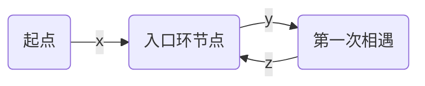

## 字符串

### 1. 字符串翻转-三步反转法

例如，字符串 abcdef ，若要让def翻转到abc的前头，只要按照下述3个步骤操作即可：

1. 首先将原字符串分为两个部分，即X:abc，Y:def；
2. 将X反转，X->X\^T，即得：abc->cba；将Y反转，Y->Y^T，即得：def->fed。
3. 反转上述步骤得到的结果字符串X\^TY^T，即反转字符串cbafed的两部分（cba和fed）给予反转，cbafed得到defabc。

### 2. 字符串包含

 比如，如果是下面两个字符串：

  String 1：ABCD

  String 2：BAD

  答案是true，即String2里的字母在String1里也都有，或者说String2是String1的真子集。

  下面代码用逻辑运算实现类似哈希表的功能

```c
// “最好的方法”，时间复杂度O(n + m)，空间复杂度O(1)
bool StringContain(string &a,string &b)
{
    int hash = 0;
    for (int i = 0; i < a.length(); ++i)
    {
        hash |= (1 << (a[i] - 'A'));
    }
    for (int i = 0; i < b.length(); ++i)
    {
        if ((hash & (1 << (b[i] - 'A'))) == 0)
        {
            return false;
        }
    }
    return true;
}
```

### 3. 正则匹配

> 请实现一个函数用来匹配包括'.'和'*'的正则表达式。模式中的字符'.'表示任意一个字符，而'*'表示它前面的字符可以出现任意次（包含0次）。 在本题中，匹配是指字符串的所有字符匹配整个模式。例如，字符串"aaa"与模式"a.a"和"ab*ac*a"匹配，但是与"aa.a"和"ab*a"均不匹配

递归算法：

```c++
class Solution {
public:
    bool match(char* str, char* pattern)
    {
        if(*str=='\0' && *pattern=='\0')
            return true;
        if(*str!='\0' && *pattern=='\0')
            return false;
        if(*(pattern+1)!='*'){
            if(*str==*pattern || (*str!='\0' && *pattern=='.'))
                return match(str+1,pattern+1);
            else return false;
        }
        else{
            if(*str==*pattern || (*str!='\0' && *pattern=='.'))
                return match(str,pattern+2) || match(str+1,pattern);
            else return match(str,pattern+2);
        }

    }
};
```

非递归算法:

```c++
class Solution {
public:
    bool match(char* str, char* pattern)
    {
        if (*str == '\0' && *pattern == '\0')
        	return true;
    	if (*str != '\0' && *pattern == '\0')
        	return false;

    	int strlength = 0;
    	int patternlength = 0;
    	int star = 0;

    	while (pattern[++patternlength] != '\0')
    	{
       	 	if (pattern[patternlength] == '*')
           		 star++;
    	}
    	while (str[++strlength] != '\0')
    	{
    	}

   		while (*pattern != '\0')
   		{
        	if (*(pattern + 1) == '*')
        	{
            	if (*str == *pattern || (*str != '\0' && *pattern == '.'))
            	{
                	if (strlength == patternlength - star * 2)
                	{
                   		pattern += 2;
                    	patternlength -= 2;
                    	star--;
                	}
                	else
                	{
                    	str++;
                    	strlength--;
               	 	}
            	}
            		else
            	{
                	pattern += 2;
                	patternlength -= 2;
                	star--;
            	}
        	}
        	else
        	{
            	if (*str == *pattern || (*str != '\0' && *pattern == '.'))
            	{
                	pattern++;
                	str++;
                	strlength--;
                	patternlength--;
            	}
            	else
            	{
                	return false;
            	}
        	}
    	}
    	if (*str == '\0' && *pattern == '\0')
        	return true;
    	if (*str != '\0' && *pattern == '\0')
    	{
        	return false;
    	}
    }
};
```

总结：有时候真的是写递归好写好多(>-<)，非递归要注意str留空给pattern，不能走贪婪模式把所有符合条件的'*'都匹配了，这样会出错。

### 4. 全排列

> 输入一个字符串，打印出该字符串中字符的所有排列。你可以以任意顺序返回这个字符串数组，但里面不能有重复元素。

  ```go
/**
 * @param {string} s
 * @return {string[]}
 */
var permutation = function (s) {
    let c = Array.from(s);
    let res = [];
    function dfs(x) {
        if (x == c.length - 1) {
            res.push(c.join("")); // 添加排列方案
            return;
        }
        let set = new Map();
        for (let i = x; i < c.length; i++) {
            if (set.has(c[i])) continue; // 重复，因此剪枝
            set.set(c[i]);
            swap(i, x); // 交换，将 c[i] 固定在第 x 位
            dfs(x + 1); // 开启固定第 x + 1 位字符
            swap(i, x); // 恢复交换
        }
    }
    function swap(a, b) {
        let tmp = c[a];
        c[a] = c[b];
        c[b] = tmp;
    }
    dfs(0);
    return res;
};
  ```

#### 有序的全排列

给出集合 `[1,2,3,…,*n*]`，其所有元素共有 *n*! 种排列。

按大小顺序列出所有排列情况，并一一标记，当 *n* = 3 时, 所有排列如下：

1. `"123"`
2. `"132"`
3. `"213"`
4. `"231"`
5. `"312"`
6. `"321"`

给定 *n* 和 *k*，返回第 *k* 个排列。

```js
var getPermutation = function (n, k) {
  let arr = new Array(n)
  let visit = new Array(n)
  for (let i = 0; i < n; i++) {
    arr[i] = i + 1
  }
  let res = []
  function recur (path) {
    if (path.length == n) {
      res.push(path)
      return
    }
    for (let i = 0; i < arr.length; i++) {
      if (!visit[i] && res.length < k) {
        visit[i] = true
        recur(path + arr[i])
        visit[i] = false
      }
    }
  }
  recur('')
  return res[res.length - 1]
};
```


### 5. 判断字符重排

```
给定两个字符串 s1 和 s2，请编写一个程序，确定其中一个字符串的字符重新排列后，能否变成另一个字符串。
```

>  示例 1：

```
输入: s1 = "abc", s2 = "bca"
输出: true
```

```js
var CheckPermutation = function (s1, s2) {
    let len1 = s1.length, len2 = s2.length;
    if (len1 != len2) return false;
    let arr = new Array(52).fill(0);
    let start = "A".charCodeAt(0);
    for (let i = 0; i < len2; i++) {
        let index1 = s1.charCodeAt(i) - start;
        let index2 = s2.charCodeAt(i) - start;
        arr[index1]++;
        arr[index2]--;
    }
    for (let j = 0; j < arr.length; j++) {
        if (arr[j]) return false;
    }
    return true;
```

### 6. 验证回文串

#### 6.1 无限制条件

双指针法，直到i>=j

#### 6.2 最多可删除一个字符

还是双指针法，当前后两字符不等时，用两个循环再去判断舍弃前面的字符和舍去后面的字符的情况

### 7. 最长子回文串

```
给定一个字符串 s，找到 s 中最长的回文子串。你可以假设 s 的最大长度为 1000
```

> 示例 1：

```
输入: "babad"
输出: "bab"
注意: "aba" 也是一个有效答案。
```

> 思路

`dp[i][j]`表示[s[i],s[j]]之间是否是回文串，则

`dp[i][j] = (s[i]==s[j]) && dp[i+1][j-1]`

```js

/**
 * @param {string} s
 * @return {string}
 */
var longestPalindrome = function (s) {
    if (!s || s.length === 0) return "";
    let res = s[0];
    const dp = [];
    // 倒置相当于给dp设置了长度,不然访问dp[i+1]会报错
    for (let i = s.length - 1; i >= 0; i--) {
        dp[i] = [];
        for (let j = i; j < s.length; j++) {
            if (j - i === 0) dp[i][j] = true;
            else if (j - i === 1 && s[i] === s[j]) dp[i][j] = true;
            else if (s[i] === s[j] && dp[i + 1][j - 1]) {
                dp[i][j] = true;
            }

            if (dp[i][j] && j - i + 1 > res.length) {
                res = s.slice(i, j + 1);
            }
        }
    }
    return res;
};
```

### 8. 分割回文串

##### 8.1 输出所有可能的子串

```
给定一个字符串 s，将 s 分割成一些子串，使每个子串都是回文串。
返回 s 所有可能的分割方案。
```

> 示例:

```
输入: "aab"
输出:
[
  ["aa","b"],
  ["a","a","b"]
]
```

```js
/**
 * @param {string} s
 * @return {string[][]}
 */
var partition = function (s) {
    let len = s.length;
    // 利用7.最长子回文串的方法求得dp[i][j]表示s[i,j]是否是回文串，省去每次都去判断
    let dp = [];
    for (let i = len - 1; i >= 0; i--) {
        dp[i] = [];
        for (let j = i; j < len; j++) {
            if (j == i) dp[i][j] = true;
            else if (j == i + 1) dp[i][j] = (s[i] == s[j])
            else dp[i][j] = (s[i] == s[j] && dp[i + 1][j - 1])
        }
    }
    let res = [];
    if (len == 0) {
        return res;
    }
    let path = [];
    backtracking(0);
    return res;


    function backtracking(start) {
        if (start == len) {
            res.push([...path]);
            return;
        }
        for (let i = start; i < len; i++) {
            // 因为截取字符串是消耗性能的，因此，采用传子串索引的方式判断一个子串是否是回文子串
            // 不是的话，剪枝
            if (!dp[start][i]) {
                continue;
            }
            path.push(s.slice(start, i + 1));
            backtracking(i + 1);
            path.pop();
        }
    }
};
```

##### 8.2 输出最小分割次数

```
给定一个字符串 s，将 s 分割成一些子串，使每个子串都是回文串。
返回符合要求的最少分割次数。
```

> 示例:

```
输入: "aab"
输出: 1
解释: 进行一次分割就可将 s 分割成 ["aa","b"] 这样两个回文子串。
```

> 递归

```js
function minCut(s) {
    if (null == s || s.length < 2) {
        return 0;
    }
    let len = s.length;
    let dp = [];
    for (let i = len - 1; i >= 0; i--) {
        dp[i] = [];
        for (let j = i; j < len; j++) {
            if (j == i) dp[i][j] = true;
            else if (j == i + 1) dp[i][j] = (s[i] == s[j])
            else dp[i][j] = (s[i] == s[j] && dp[i + 1][j - 1])
        }
    }
    let memo = new Map();
    return minCut(0);

    function minCut(start) {
        if (memo.has(start)) {
            return memo.get(start);
        }
        // 如果本身是回文，不用分割，直接返回0
        if (dp[start][len - 1]) {
            return 0;
        }
        let min = Infinity;
        for (let i = start; i < len; i++) {
            // 如果[start,i]是回文，继续比较后面的
            if (dp[start][i]) {
                min = Math.min(min, minCut(i + 1) + 1);
            }
        }
        memo.set(start, min);
        return min;
    }
}
```

> 迭代

`dp[i]`表示是`s[0,i]`间最少分割的次数，有两种情况:

- `s[0,i]`本身是回文串，则`dp[i]`=0
- 若存在`0<k<i`，使得`s[k,i]`是个回文串，则`dp[i]=min(dp[i],dp[k]+1)`，`dp[k]`指的是`s[0,k]`分割成回文串的最少次数

```js


/**
 * @param {string} s
 * @return {number}
 */
var minCut = function (s) {
    let isPalindrome = [];
    let len = s.length;
    for (let i = len - 1; i >= 0; i--) {
        isPalindrome[i] = [];
        for (let j = i; j < len; j++) {
            if (j == i) isPalindrome[i][j] = true;
            else if (j == i + 1) isPalindrome[i][j] = (s[i] == s[j])
            else isPalindrome[i][j] = (s[i] == s[j] && isPalindrome[i + 1][j - 1])
        }
    }

    let dp = new Array(len).fill(len);
    dp[0] = 0;
    for (let i = 1; i < len; i++) {
        if (isPalindrome[0][i]) {
            dp[i] = 0;
            continue;
        }
        for (let j = 0; j < i; j++) {
            if (isPalindrome[j + 1][i]) {
                dp[i] = Math.min(dp[i], dp[j] + 1);
            }
        }
    }

    return dp[s.length - 1];
};
```

### 9. 单词拆分

##### 9.1 输出判断结果

```
给定一个非空字符串 s 和一个包含非空单词列表的字典 wordDict，判定 s 是否可以被空格拆分为一个或多个在字典中出现的单词。
说明：
拆分时可以重复使用字典中的单词。
你可以假设字典中没有重复的单词。
```

> 示例 1：

```
输入: s = "applepenapple", wordDict = ["apple", "pen"]
输出: true
解释: 返回 true 因为 "applepenapple" 可以被拆分成 "apple pen apple"。
     注意你可以重复使用字典中的单词。
```

> 递归

令start初始为0，判断`s[start,k]`是否在wordDict里，若在则进入下层递归，`start=k+1`，否则返回false

```js
var wordBreak = function (s, wordDict) {
    const wordSet = new Set(wordDict);
    let hash = new Map();
    return check(0);

    function check(start) {
        if (start > s.length - 1) return true;
        if (hash.has(start)) return hash.get(start);
        for (let end = start + 1; end <= s.length; end++) {
            const word = s.slice(start, end);
            if (wordSet.has(word) && check(end)) {
                hash.set(start, true);
                return true;
            }
        }
        hash.set(start, false);
        return false;
    };
};
```

> 动态规划

`dp[i]`表示`s[0,i]`是否等于wordDict的某一单词，设0<=j<i，则

`dp[i]=dp[j] && wordSet.has(s.slice(j, i))`，`dp[j]`表示前部分符合，`wordSet.has(s.slice(j, i))`表示后部分符合，只有两者都成立`dp[i]`才能为true

```js
var wordBreak = function (s, wordDict) {
    const wordSet = new Set(wordDict);
    let len = s.length;
    let dp = new Array(len + 1).fill(false);
    dp[0] = true;
    for (let i = 1; i <= len; i++) {
        for (let j = i - 1; j >= 0; j--) {
            if (dp[j] && wordSet.has(s.slice(j, i))) {
                dp[i] = true;
                break;
            }
        }
    }
    return dp[len]
};
```

##### 9.2 输出所有可能的组合

```
给定一个非空字符串 s 和一个包含非空单词列表的字典 wordDict，在字符串中增加空格来构建一个句子，使得句子中所有的单词都在词典中。返回所有这些可能的句子。
说明：
分隔时可以重复使用字典中的单词。
你可以假设字典中没有重复的单词
```

> 示例 1：

```
输入:
s = "catsanddog"
wordDict = ["cat", "cats", "and", "sand", "dog"]
输出:
[
  "cats and dog",
  "cat sand dog"
]
```

> 动态规划

执行以下用例超时：从前往后存字符串过长，内存爆了

```
"aaaaaaaaaaaaaaaaaaaaaaaaaaaaaaaaaaaaaaaaaaaaaaaaaaaaaaaaaaaaaaaaaaaaaaaaaaabaaaaaaaaaaaaaaaaaaaaaaaaaaaaaaaaaaaaaaaaaaaaaaaaaaaaaaaaaaaaaaaaaaaaaaaaaaa"
["a","aa","aaa","aaaa","aaaaa","aaaaaa","aaaaaaa","aaaaaaaa","aaaaaaaaa","aaaaaaaaaa"]
```

```js
var wordBreak = function (s, wordDict) {
    let len = s.length
    let wordSet = new Set(wordDict)
    let dp = new Array(len + 1);
    for (let n = 0; n <= len; n++) {
        dp[n] = [];
    }
    dp[0].push("")
    for (let i = 1; i <= len; i++) {
        for (let j = i - 1; j >= 0; j--) {
            let str = s.slice(j, i);
            if (dp[j].length && wordSet.has(str)) {
                for (let v of dp[j]) {
                    if (v == "") dp[i].push(str);
                    else dp[i].push(`${v} ${str}`);
                }
            }
        }
    }
    return dp[len]
};
```

> 递归

下面比较下两种写法：

- 写法一

类似于中序遍历，每进入一层便将结果拼接到preStr，到底了就将这条路径push到res中，缺点：自顶向下，无法剪枝

```js
var wordBreak = function (s, wordDict) {
    let len = s.length;
    let wordSet = new Set(wordDict);
    let res = [];
    recur(0, '');
    return res

    function recur(start, preStr) {
        if (start == len) {
            if (preStr != '') res.push(preStr);
            return;
        }
        for (let i = start + 1; i <= len; i++) {
            let str = s.slice(start, i);
            if (wordSet.has(str)) {
                let temp = preStr == '' ? str : `${preStr} ${str}`;
                recur(i, temp);
            }
        }
    }
};
```

- 写法二

每有一条路径到底了就push一个空字符串，后面通过回溯将结果拼接进去，这样每一个节点自底而上的结果都是一样的，因此可以剪枝，如果是自顶而下的话，该节点可以有不同的结果，因此不可以剪枝

```js
var wordBreak = function (s, wordDict) {
    let len = s.length;
    let wordSet = new Set(wordDict);
    let hash = new Map();
    return recur(0);

    function recur(start) {
        if (hash.has(start)) return hash.get(start);
        let res = [];
        if (start == len) {
            res.push('');
        }
        for (let i = start + 1; i <= len; i++) {
            let str = s.slice(start, i);
            if (wordSet.has(str)) {
                let list = recur(i);
                for (let v of list) {
                    let temp = v == '' ? str : `${str} ${v}`;
                    res.push(temp);
                }
            }
        }
        hash.set(start, res);
        return res;
    }
};
```

### 10 . 单词搜索

##### 10.0 前置知识（字典树）

> 创建字典树（前缀树），10.2用到

```js
var Trie = function () {
    this.next = {};
    this.isEnd = false;
};

Trie.prototype.insert = function (word) {
    if (!word) return
    let ptr = this;
    for (let w of word) {
        if (!ptr.next[w]) ptr.next[w] = new Trie();
        ptr = ptr.next[w];
    }
    ptr.isEnd = true;
};

Trie.prototype.search = function (word) {
    if (!word) return
    let ptr = this;
    for (let w of word) {
        if (!ptr.next[w]) return false;
        ptr = ptr.next[w];
    }
    return ptr.isEnd;
};

Trie.prototype.startsWith = function (prefix) {
    if (!prefix) return
    let ptr = this;
    for (let w of prefix) {
        if (!ptr.next[w]) return false;
        ptr = ptr.next[w];
    }
    return true;
};
```

##### 10.1 搜索单个单词

```
给定一个二维网格和一个单词，找出该单词是否存在于网格中。
单词必须按照字母顺序，通过相邻的单元格内的字母构成，其中“相邻”单元格是那些水平相邻或垂直相邻的单元格。同一个单元格内的字母不允许被重复使用。
```

> 示例:

```
board =
[
  ['A','B','C','E'],
  ['S','F','C','S'],
  ['A','D','E','E']
]
给定 word = "ABCCED", 返回 true
给定 word = "SEE", 返回 true
给定 word = "ABCB", 返回 false
```

```js
var exist = function (board, word) {
    let len = word.length;
    let height = board.length;
    let width = board[0].length;
    for (let i = 0; i < height; i++) {
        for (let j = 0; j < width; j++) {
            if (recur(i, j, 0)) return true
        }
    }
    return false

    function recur(i, j, start) {
        if (i < 0 || j < 0 || i == height || j == width) return false
        if (board[i][j] != word[start]) return false;
        if (start == len - 1) return true;
        let temp = board[i][j];
        board[i][j] = false;
        if (recur(i - 1, j, start + 1)) return true;
        if (recur(i + 1, j, start + 1)) return true;
        if (recur(i, j - 1, start + 1)) return true;
        if (recur(i, j + 1, start + 1)) return true;
        board[i][j] = temp
        return false;
    }
};
```

##### 10.2 搜索多个单词

```
给定一个二维网格 board 和一个字典中的单词列表 words，找出所有同时在二维网格和字典中出现的单词。
单词必须按照字母顺序，通过相邻的单元格内的字母构成，其中“相邻”单元格是那些水平相邻或垂直相邻的单元格。同一个单元格内的字母在一个单词中不允许被重复使用。
```

> 示例:

```
输入:
words = ["oath","pea","eat","rain"] and board =
[
  ['o','a','a','n'],
  ['e','t','a','e'],
  ['i','h','k','r'],
  ['i','f','l','v']
]
输出: ["eat","oath"]
```

```js
/**
 * @param {character[][]} board
 * @param {string[]} words
 * @return {string[]}
 */
var findWords = function (board, words) {
    // 构建字典树
    class TrieNode {
        constructor() {
            this.END = -1;
            this.children = {};
        }
    }
    let root = null;
    let Trie = function () {
        root = new TrieNode();
    };
    Trie.prototype.insert = function (word, index) {
        let currNode = root;
        for (let i = 0; i < word.length; i++) {
            if (currNode.children[word[i]] == undefined) {
                currNode.children[word[i]] = new TrieNode();
            }
            currNode = currNode.children[word[i]];
        }
        currNode.END = index;
    };
    // 初始化变量
    let m = board.length;
    let n = board[0].length;
    // 初始化字典树
    let wordsTrie = new Trie();
    for (let i = 0; i < words.length; i++) {
        wordsTrie.insert(words[i], i);
    }
    // 寻找结果
    let result = [];
    for (let i = 0; i < m; i++) {
        for (let j = 0; j < n; j++) {
            boardDFS(i, j, root);
        }
    }
    return result;

    // DFS 搜索
    function boardDFS(i, j, currNode) {
        // 字典树中找到了
        if (currNode.END != -1) {
            result.push(words[currNode.END]);
            currNode.END = -1; // 防止加入重复的结果
        }
        if (i < 0 || j < 0 || i == m || j == n) {
            return;
        }
        const restore = board[i][j];
        if (restore == '#' || !currNode.children[restore]) {
            return;
        }
        // 前进
        board[i][j] = '#';
        boardDFS(i - 1, j, currNode.children[restore]);
        boardDFS(i + 1, j, currNode.children[restore]);
        boardDFS(i, j - 1, currNode.children[restore]);
        boardDFS(i, j + 1, currNode.children[restore]);
        // 还原(回溯)
        board[i][j] = restore;
    }
};
```

### 11. 有效的字母异位词

```
给定两个字符串 s 和 t ，编写一个函数来判断 t 是否是 s 的字母异位词。
```

> 示例 1:

```
输入: s = "anagram", t = "nagaram"
输出: true
```

此题用亦或的方法不行，另外排序的效率也不高，故舍去

```js
var isAnagram = function (s, t) {
    if (s.length != t.length) return false;
    let hash = new Map();
    let start = "A".charCodeAt(0);
    for (let i = 0; i < s.length; i++) {
        let temp = s.charCodeAt(i) - start;
        if (hash.has(temp))
            hash.set(temp, hash.get(temp) + 1);
        else hash.set(temp, 1);
        temp = t.charCodeAt(i) - start;
        if (hash.has(temp))
            hash.set(temp, hash.get(temp) - 1);
        else hash.set(temp, -1);
    }
    // 注意map是k-v类型的，要使用[k,v]去迭代
    for (let [k, v] of hash) {
        if (v != 0) return false
    }
    return true
};
```

### 12. 最长公共子前缀

编写一个函数来查找字符串数组中的最长公共前缀。

如果不存在公共前缀，返回空字符串 `""`。

**示例 1:**

```
输入: ["flower","flow","flight"]
输出: "fl"
```

横向扫描

```js
var longestCommonPrefix = function(strs) {
    if(strs.length == 0)
        return "";
    // 先把第一个字符串存入答案
    let ans = strs[0];
    // 从第二个字符串开始遍历
    for(let i =1;i<strs.length;i++) {
        for(let j=0;j<ans.length && j < strs[i].length;j++) {
            if(ans[j] != strs[i][j])
                break;
        }
        // 缩小范围，每次遍历切割一次
        ans = ans.substr(0, j);
        // 如果答案为空，提前返回
        if(ans === "")
            return ans;
    }
    return ans;
};
```

纵向扫描

```js
var longestCommonPrefix = function (strs) {
    if (!strs || !strs.length) return ""
    // 从第一个字符串开始纵向遍历每一个字符
    for (let i = 0; i < strs[0].length; i++) {
        // 从第二个字符串开始和第一个字符串的每一个字母比较
        for (let j = 1; j < strs.length; j++) {
            // 当不相等或者遍历的位数超出了要比较的字符串，直接返回结果
            if (strs[j][i] != strs[0][i] || i >= strs[j].length) {
                return strs[0].slice(0, i)
            }
        }
    }
    return strs[0]
};
```

### 13. 最长不含重复字符的子字符串

请从字符串中找出一个最长的不包含重复字符的子字符串，计算该最长子字符串的长度。

```js
var lengthOfLongestSubstring = function (s) {
    let hash = new Map()
    let i = -1;
    let res = 0;
    for (let j = 0; j < s.length; j++) {
        if (hash.has(s[j])) {
            // 这里要取最大值,如"abba",从0开始,当j移动到3时,i=1,hash.get(s[j])=0,因此要取最大值
            i = Math.max(hash.get(s[j]), i)
        }
        hash.set(s[j], j)
        res = Math.max(res, j - i)
    }
    return res
};
```

### 14. 字符串的排列

给定两个字符串 **s1** 和 **s2**，写一个函数来判断 **s2** 是否包含 **s1** 的排列。

换句话说，第一个字符串的排列之一是第二个字符串的子串。

**示例1:**

```
输入: s1 = "ab" s2 = "eidbaooo"
输出: True
解释: s2 包含 s1 的排列之一 ("ba").
```

```js
var checkInclusion = function (s1, s2) {
  if (s1.length > s2.length) return false
  let a = 'a'.charCodeAt()
  let m1 = new Array(26).fill(0)
  let m2 = new Array(26).fill(0)
  // 保存s1和s2的滑动窗口,长度都为s1.length
  for (let i = 0; i < s1.length; i++) {
    m1[s1[i].charCodeAt() - a]++
    m2[s2[i].charCodeAt() - a]++
  }
  for (let i = 0; i < s2.length - s1.length; i++) {
    // 先判断
    if (check(m1, m2)) return true
    m2[s2[i].charCodeAt() - a]--
    // 这里是预处理,注意越界问题
    m2[s2[i + s1.length].charCodeAt() - a]++
  }
  // 别忘了再次判断
  return check(m1, m2)
};

function check (a, b) {
  for (let i = 0; i < a.length; i++) {
    if (a[i] != b[i]) {
      return false
    }
  }
  return true
}
```

### 15. 还原ip地址

给定一个只包含数字的字符串，复原它并返回所有可能的 IP 地址格式。

**有效的 IP 地址** 正好由四个整数（每个整数位于 0 到 255 之间组成，且不能含有前导 `0`），整数之间用 `'.' `分隔。

例如："0.1.2.201" 和 "192.168.1.1" 是 **有效的** IP 地址，但是 "0.011.255.245"、"192.168.1.312" 和 "192.168@1.1" 是 **无效的** IP 地址。

```js
var restoreIpAddresses = function (s) {
  let res = []
  function recur (depth, str, path) {
    if (str === '' || depth == 3) {
      if (str === '' && depth == 3) {
        res.push(path)
      }
      return
    }
    for (let i = 1; i <= 3; i++) {
      let temp = str.slice(0, i)
      // 注意处理判断<255 , 还要判断是否以0开头类似010这种
      if ((temp <= 255 && temp[0] != 0) || temp == '0') {
        recur(depth + 1, str.slice(i), path + '.' + temp)
      }
      // 这个条件说明,剩余的字符串仅够分一次,比如
      // i=2 str='a' str.slice(0, 2)和str.slice(0, 3)的结果是一样的
      // 满足条件就直接break
      if (i >= str.length) {
        break
      }
    }
  }

  for (let i = 1; i <= 3; i++) {
    let temp = s.slice(0, i)
    if ((temp <= 255 && temp[0] != 0) || temp == '0') {
      recur(0, s.slice(i), temp)
    }
  }
  return res
};
```


## 数组

- 从左到右递增，从上到下递增的二维数组找目标，应该从左下角找起，大于目标上移，小于目标右移
-  在一个长度为n的数组里的所有数字都在0到n-1的范围内 ，要找到任意重复的数字只需在array[array[i]]加上n标记即可，若标记了两次则重复，此时array[array[i]]-n>n

### 1. 求众数

#### 众数1

```
数组中占比超过一半的元素称之为主要元素。给定一个整数数组，找到它的主要元素。若没有，返回-1。
```

> 示例 1：

```
输入：[1,2,5,9,5,9,5,5,5]
输出：5
```

```js
/**
 * @param {number[]} nums
 * @return {number}
 */
var majorityElement = function (nums) {
    let len = nums.length
    if (len == 0) return -1;
    let res = nums[0], count = 1;
    for (let i = 1; i < len; i++) {
        if (res == nums[i]) count++;
        else if (count == 0) { res = nums[i]; count++ }
        else count--;
    }
    return count >= 1 ? res : -1;
};
```

#### 众数2

给定一个大小为 *n* 的数组，找出其中所有出现超过 `⌊ n/3 ⌋` 次的元素。

**说明:** 要求算法的时间复杂度为 O(n)，空间复杂度为 O(1)。

**示例 1:**

```
输入: [3,2,3]
输出: [3]
```

```js
/**
 * @param {number[]} nums
 * @return {number[]}
 */
var majorityElement = function (nums) {
    let len = nums.length;
    if (len < 2) return nums;
    let res1 = res2 = nums[0];
    let count1 = count2 = 0;
    for (let i = 0; i < len; i++) {
        if (nums[i] == res1) count1++; // 投票
        else if (nums[i] == res2) count2++;
        else if (count1 == 0) { res1 = nums[i]; count1++; } // 重新选
        else if (count2 == 0) { res2 = nums[i]; count2++; }
        else { // 抵消
            count1--;
            count2--;
        }
    }
    // 计数阶段
    // 找到了两个候选人之后，需要确定票数是否满足大于 N/3
    count1 = 0;
    count2 = 0;
    let res = []
    for (let num of nums) {
        if (res1 == num) count1++;
        else if (res2 == num) count2++;
    }
    if (count1 > nums.length / 3) res.push(res1);
    if (count2 > nums.length / 3) res.push(res2);
    return res;
};
```

#### 总结

```
摩尔投票法：
如果至多选一个代表，那他的票数至少要超过一半（⌊ 1/2 ⌋）的票数；
如果至多选两个代表，那他们的票数至少要超过⌊ 1/3 ⌋的票数；
如果至多选m个代表，那他们的票数至少要超过⌊ 1/(m+1) ⌋的票数。
```

### 2. 旋转数组

> 注意：**数组旋转n次和旋转一次的效果是一样的**

#### 原地旋转

```
给定一个数组，将数组中的元素向右移动 k 个位置，其中 k 是非负数。
```

> 示例 1

```
输入: [1,2,3,4,5,6,7] 和 k = 3
输出: [5,6,7,1,2,3,4]
解释:
向右旋转 1 步: [7,1,2,3,4,5,6]
向右旋转 2 步: [6,7,1,2,3,4,5]
向右旋转 3 步: [5,6,7,1,2,3,4]
```

用环状的方法解题

```js
var rotate = function (nums, k) {
    k = k % nums.length;
    // 注意这个count，记录移动的次数
    let count = 0;
    for (let i = 0; count < nums.length; i++) {
        let start = i;
        let pre = nums[start];
        do {
            let next = (start + k) % nums.length;
            let temp = nums[next];
            nums[next] = pre;
            pre = temp;
            start = next;
            count++;
        } while (i != start);
    }
};
```

翻转

```js
var rotate = function (nums, k) {
    var n = nums.length;
    k %= n;
    if (n == 1) {
        return;
    }
    var tmp = 0;
    myReverse(0, n - 1);
    myReverse(0, k - 1);
    myReverse(k, n - 1);
    function myReverse(start, end) {
        while (start < end) {
            tmp = nums[start];
            nums[start] = nums[end];
            nums[end] = tmp;
            start++;
            end--;
        }
    }
};
```

#### 求最小值

##### 不含重复元素

```
假设按照升序排序的数组在预先未知的某个点上进行了旋转。

( 例如，数组 [0,1,2,4,5,6,7] 可能变为 [4,5,6,7,0,1,2] )。

请找出其中最小的元素。

你可以假设数组中不存在重复元素。
```

> 示例 1

```
输入: [3,4,5,1,2]
输出: 1
```

```js
// 如果没有旋转，mid始终是小于right的，旋转后如果mid大于right,则最小值肯定是旋转到了右边，将left右移即可
var findMin = function (nums) {
    var left = 0;
    var right = nums.length - 1;
    while (left < right) {
        var mid = (left + right) >> 1;
        if (nums[mid] > nums[right]) {
            left = mid + 1;
        } else {
            right = mid;
        }
    }
    return nums[left];
};
```

##### 含重复元素

```js
/**
 * @param {number[]} nums
 * @return {number}
 */
var findMin = function (nums) {
    let left = 0;
    let right = nums.length - 1;
    while (left < right) {
        let mid = (left + right) >> 1;
        if (nums[mid] < nums[right]) {
            // 这里不能用right=mid-1;因为最终结果返回nums[left],如果恰好mid-1就是结果,那么就不对了
            right = mid;
        }else if (nums[mid] > nums[right]) {
            left = mid + 1;
        }else {
            // 当有重复元素时，无法知道最小值在左边还是右边，因此可通过右边界减一缩小范围继续查找
            right -= 1;
        }
    }
    return nums[left];
};
```

#### 求特定值

##### 不含重复元素

```js
var search = function (nums, target) {
    let n = nums.length;
    if (!n) return -1;
    if (n == 1) return nums[0] == target ? 0 : -1;
    let l = 0, r = n - 1;
    while (l <= r) {
        let mid = (l + r) >> 1;
        if (nums[mid] == target) return mid;
        // 下面的判断都是围绕舍弃左边还是右边进行
        // mid总能将数组分割成有序和无序的两部分
        // 这个条件表明nums[0,mid]有序
        if (nums[0] <= nums[mid]) {
            // target在nums[0,mid]之间，右指针左移
            // nums[0,mid]必须有序才能这么判断，否则这个条件永假，因为nums[0]永远大于nums[mid]
            if (nums[0] <= target && target < nums[mid]) {
                r = mid - 1;
            } else {
                l = mid + 1;
            }
        } else {// 进入else表明nums[mid,right]有序
            // target在nums[mid,right]之间
            if (nums[mid] < target && target <= nums[n - 1]) {
                l = mid + 1;
            } else {
                r = mid - 1;
            }
        }
    }
    return -1;
};
```

##### 含重复元素

###### 求是否含有

```js
var search = function (nums, target) {
    let len = nums.length;
    if (len == 0) return false;
    if (len == 1) return nums[0] == target;
    let left = 0, right = len - 1
    while (left <= right) {
        let mid = (left + right) >> 1;
        if (nums[mid] == target) return true;
        // 如果相等则无法判断哪边是有序的，通过left++缩小一下范围
        if (nums[left] == nums[mid]) {
            left++
        } else if (nums[left] < nums[mid]) {
            if (nums[left] <= target && target < nums[mid]) {
                right = mid - 1
            } else {
                left = mid + 1
            }
        } else {
            if (nums[mid] < target && target <= nums[right]) {
                left = mid + 1
            } else {
                right = mid - 1
            }
        }
    }
    return false
};
```

###### 求最先匹配的索引

```js
var search = function (nums, target) {
    let len = nums.length;
    if (len == 0) return -1;
    if (len == 1) return nums[0] == target ? 0 : -1;
    let left = 0, right = len - 1
    while (left <= right) {
        // 如果左边判断正确直接返回
        if (nums[left] == target) return left;
        let mid = (left + right) >> 1;
        // 如果中间判断正确直接，检测相邻的左边是否有目标数
        if (nums[mid] == target) {
            while (nums[--mid] == target);
            return mid + 1;
        }
        // 如果相等则无法判断哪边是有序的，通过left++缩小一下范围
        if (nums[left] == nums[mid]) {
            left++
        } else if (nums[left] < nums[mid]) {
            if (nums[left] <= target && target < nums[mid]) {
                right = mid - 1
            } else {
                left = mid + 1
            }
        } else {
            if (nums[mid] < target && target <= nums[right]) {
                left = mid + 1
            } else {
                right = mid - 1
            }
        }
    }
    return -1
};
```

### 3. 移动0

```
给定一个数组 nums，编写一个函数将所有 0 移动到数组的末尾，同时保持非零元素的相对顺序。
```

> 示例

```
输入: [0,1,0,3,12]
输出: [1,3,12,0,0]
```

解法1

```js
// 先赋值再补0
var moveZeroes = function (nums) {
    for (let i = j = 0; i < nums.length; i++) {
        if (nums[i]) {
            nums[j] = nums[i];
            j++;
        }
    }
    for (; j < nums.length; j++) {
        nums[j] = 0;
    }
};
```

解法2

```js
// 每当nums！=0时，交换nums[i]和nums[j],然后j++
var moveZeroes = function (nums) {
    for (let i = j = 0; i < nums.length; i++) {
        if (nums[i]) {
            let temp = nums[i];
            nums[i] = nums[j]
            nums[j] = temp;
            j++;
        }
    }
};

```

### 4. 打乱数组

```js
var Solution = function (nums) {
    this.pre = nums;
};

Solution.prototype.reset = function () {
    return this.pre
};

Solution.prototype.shuffle = function () {
    let copy = [...this.pre]
    for (let i = copy.length - 1; i > 0; i--) {
        // 这里r的范围是[0,i]，注意自身也要考虑到有交换的可能
        let r = Math.floor(Math.random() * (i + 1));
        [copy[i], copy[r]] = [copy[r], copy[i]]
    }
    return copy
};
```

### 5. 求数组交集

#### 解法一

现将长度较短的数组中的元素存进hash表，重复的加一，然后遍历另一个数组，得到结果

```js
var intersect = function (nums1, nums2) {
    if (nums1.length > nums2.length) return intersect(nums2, nums1);
    let hash = {}
    let res = []
    for (let i = 0; i < nums1.length; i++) {
        if (hash[nums1[i]]) hash[nums1[i]]++;
        else hash[nums1[i]] = 1;
    }
    for (let i = 0; i < nums2.length; i++) {
        if (hash[nums2[i]] > 0) {
            hash[nums2[i]]--;
            res.push(nums2[i])
        }
    }
    return res
};
```

### 6. 递增的三元子序列

```
给定一个未排序的数组，判断这个数组中是否存在长度为 3 的递增子序列。

数学表达式如下:
如果存在这样的 i, j, k,  且满足 0 ≤ i < j < k ≤ n-1，
使得 arr[i] < arr[j] < arr[k] ，返回 true ; 否则返回 false 。

说明: 要求算法的时间复杂度为 O(n)，空间复杂度为 O(1) 。
```

```js
var increasingTriplet = function (nums) {
    if (nums.length < 3) return false
    let min = mid = Infinity;
    for (let i = 0; i < nums.length; i++) {
        if (min >= nums[i]) min = nums[i];
        else if (mid >= nums[i]) mid = nums[i];
        else return true
        // 以下写法是错的，等号必须在min这里拦截，保证min和mid是不同的两个数
        // if (min > nums[i]) min = nums[i];
        // else if (mid > nums[i]) mid = nums[i];
        // else if (mid < nums[i]) return true
    }
    return false
};
```

### 7. 除自身以外数组的乘积

**示例:**

```
输入: [1,2,3,4]
输出: [24,12,8,6]
```

```js
var productExceptSelf = function (nums) {
    let length = nums.length;

    let L = new Array(length).fill(0);
    let R = new Array(length).fill(0);
    let answer = new Array(length);

    L[0] = 1;
    for (let i = 1; i < length; i++) {
        // 注意这里不能用L[i]*=nums[i]，因为要求i之前的乘积和，不包括i
        L[i] = nums[i - 1] * L[i - 1];
    }

    R[length - 1] = 1;
    for (let i = length - 2; i >= 0; i--) {
        R[i] = nums[i + 1] * R[i + 1];
    }
    for (let i = 0; i < length; i++) {
        answer[i] = L[i] * R[i];
    }

    return answer;
};
```

空间复杂度为O(1)的解法

```js
var productExceptSelf = function (nums) {
    let length = nums.length;
    let answer = new Array(length);

    answer[0] = 1;
    for (let i = 1; i < length; i++) {
        answer[i] = nums[i - 1] * answer[i - 1];
    }
	// 相比方法一，用R代替第二个辅助数组
    let R = 1;
    for (let i = length - 1; i >= 0; i--) {
        answer[i] = answer[i] * R;
        R *= nums[i];
    }
    return answer;
};
```

### 8. 寻找重复数

给定一个包含 n + 1 个整数的数组 nums，其数字都在 1 到 n 之间（包括 1 和 n），可知至少存在一个重复的整数。假设只有一个重复的整数，找出这个重复的数。

示例 1:

```
输入: [1,3,4,2,2]
输出: 2
```

```js
// 快慢指针法
var findDuplicate = function (nums) {
    let slow = fast = 0
    // 寻找相遇点
    do {
        slow = nums[slow]
        fast = nums[nums[fast]]
    } while (slow != fast)

    // 寻找入口
    slow = 0
    while (slow != fast) {
        slow = nums[slow]
        fast = nums[fast]
    }
    return slow
};
```

### 9. 岛屿问题

给定一个包含了一些 `0` 和 `1` 的非空二维数组 `grid` 。

一个 **岛屿** 是由一些相邻的 `1` (代表土地) 构成的组合，这里的「相邻」要求两个 `1` 必须在水平或者竖直方向上相邻。你可以假设 `grid` 的四个边缘都被 `0`（代表水）包围着。

找到给定的二维数组中最大的岛屿面积。(如果没有岛屿，则返回面积为 `0` 。)

```js
var maxAreaOfIsland = function (grid) {
  let len1 = grid.length
  if (len1 == 0) return 0
  let len2 = grid[0].length
  if (len2 == 0) return 0
  let max = res = 0
  function recur (i, j) {
    if (i < 0 || i >= len1 || j < 0 || j >= len2) {
      return
    }
    if (grid[i][j] === '*') {
      return
    }
    if (grid[i][j] === 1) {
      // 需要全局统计
      res++
      grid[i][j] = '*'
      recur(i, j + 1)
      recur(i, j - 1)
      recur(i + 1, j)
      recur(i - 1, j)
    } else {
      grid[i][j] = '*'
    }
  }
  for (let i = 0; i < len1; i++) {
    for (let j = 0; j < len2; j++) {
      // 每次统计前置0
      res = 0
      recur(i, j)
      max = Math.max(max, res)
    }
  }
  return max
};
```

### 10. 接雨水

给定 *n* 个非负整数表示每个宽度为 1 的柱子的高度图，计算按此排列的柱子，下雨之后能接多少雨水。


上面是由数组 [0,1,0,2,1,0,1,3,2,1,2,1] 表示的高度图，在这种情况下，可以接 6 个单位的雨水（蓝色部分表示雨水）

```js
var trap = function (height) {
  let l = 0
  let temp = 0
  let res = 0
  let h = new Map()
  // 正向算一遍
  for (let i = 1; i < height.length; i++) {
    if (height[l] > height[i]) {
      temp += height[l] - height[i]
    } else {
      h.set(l, i)
      res += temp
      temp = 0
      l = i
    }
  }
  l = height.length - 1
  temp = 0
  // 反向算一遍
  for (let i = height.length - 2; i >= 0; i--) {
    if (height[l] > height[i]) {
      temp += height[l] - height[i]
    } else {
      // 正向没有算过才需要赋值
      if (!(h.has(i) && h.get(i) == l)) {
        res += temp
      }
      temp = 0
      l = i
    }
  }
  return res
};
```

### 11. 朋友圈

班上有 **N** 名学生。其中有些人是朋友，有些则不是。他们的友谊具有是传递性。如果已知 A 是 B 的朋友，B 是 C 的朋友，那么我们可以认为 A 也是 C 的朋友。所谓的朋友圈，是指所有朋友的集合。

给定一个 **N \* N** 的矩阵 **M**，表示班级中学生之间的朋友关系。如果M[i][j] = 1，表示已知第 i 个和 j 个学生**互为**朋友关系，否则为不知道。你必须输出所有学生中的已知的朋友圈总数。

**示例 1：**

```
输入：
[[1,1,0],
 [1,1,0],
 [0,0,1]]
输出：2
解释：已知学生 0 和学生 1 互为朋友，他们在一个朋友圈。
第2个学生自己在一个朋友圈。所以返回 2 。
```

```js
var findCircleNum = function (M) {
  let len1 = M.length
  if (len1 == 0) return 0
  let len2 = M[0].length
  if (len2 == 0) return 0
  let people = 0
  let res = 0
  function recur (i, j) {
    if (i < 0 || i >= len1 || j < 0 || j >= len2) {
      return
    }
    if (M[i][j] == '*') return
    if (M[i][j] == 1) {
      M[i][j] = '*'
      people++
      let up = i
      let left = j
      while (left < len2) recur(i, ++left)
      while (up < len1) recur(++up, j)
      // 每次走完i和j要回到原点
      left = j
      up = i
      while (left >= 0) recur(i, --left)
      while (up >= 0) recur(--up, j)
    } else {
      M[i][j] = '*'
    }
  }
  for (let i = 0; i < len1; i++) {
    for (let j = 0; j < len2; j++) {
      people = 0
      recur(i, j)
      if (people > 0) {
        res++
      }
    }
  }
  return res
};
```

### 12. 三数之和

给你一个包含 n 个整数的数组 nums，判断 nums 中是否存在三个元素 a，b，c ，使得 a + b + c = 0 ？请你找出所有满足条件且不重复的三元组。

```js
/**
 * 整体思路:
  先排序,再固定第一个数,后面两个数用双指针,右指针不断左移逼近,
  如果不满足条件,左指针右移,再重复移动右指针
*/
var threeSum = function (nums) {
  // 先排序
  nums = nums.sort((a, b) => a - b)
  let len = nums.length;
  let res = []
  for (let first = 0; first < len; first++) {
    // 找第一个数,遇到重复的就跳过
    if (first > 0 && nums[first] == nums[first - 1]) {
      continue
    }
    let target = - nums[first]
    let third = len - 1
    for (let second = first + 1; second < third; second++) {
      // 找第二个数,遇到重复的就跳过
      if (second > first + 1 && nums[second] == nums[second - 1]) {
        continue
      }
      // 后面两数之和大于target,说明第三个数大了,执行third--
      while (nums[second] + nums[third] > target && second < third) {
        third--
      }
      // 如果执行到这步,说明不符条件,退出这个循环重新找
      if (third == second) break
      // 找到了,就存到res
      if (nums[second] + nums[third] == target) {
        res.push([nums[first], nums[second], nums[third]])
      }
    }
  }
  return res
};
```


## 二叉树

- 深度遍历有前序、中序以及后序三种遍历方法
- 广度遍历即我们寻常所说的层次遍历。

### 最近公共祖先

```js
var lowestCommonAncestor = function (root, p, q) {
  let res = null
  function recur (root) {
    if (!root || root == p || root == q) return root
    let l = recur(root.left)
    let r = recur(root.right)
    if (l && r) {
      return root
    }
    return l || r
  }
  return recur(root)
};
```

## 递归/迭代

### 1. 寻路问题

请设计一个函数，用来判断在一个矩阵中是否存在一条包含某字符串所有字符的路径。路径可以从矩阵中的任意一格开始，每一步可以在矩阵中向左、右、上、下移动一格。如果一条路径经过了矩阵的某一格，那么该路径不能再次进入该格子。例如，在下面的3×4的矩阵中包含一条字符串“bfce”的路径（路径中的字母用加粗标出）。

[["a","b","c","e"],
["s","f","c","s"],
["a","d","e","e"]]

但矩阵中不包含字符串“abfb”的路径，因为字符串的第一个字符b占据了矩阵中的第一行第二个格子之后，路径不能再次进入这个格子。

初级版本(超出时间限制)

```go
var res bool
var temp [][]bool

func exist(board [][]byte, word string) bool {
	res = false
	temp = make([][]bool, len(board))
	for i := 0; i < len(board); i++ {
		temp[i] = make([]bool, len(board[i]))
	}

	for i := 0; i < len(board); i++ {
		for j := 0; j < len(board[i]); j++ {
			if word[0] == board[i][j] {
				recur(board, []byte(word), i, j, 0)
				if res {
					return res
				}
			}
		}
	}
	return res
}

func recur(board [][]byte, word []byte, i int, j int, index int) {
	if i < 0 || i >= len(board) {
		return
	}
	if j < 0 || j >= len(board[0]) {
		return
	}

	if temp[i][j] {
		return
	}

	temp[i][j] = true

	if word[index] == board[i][j] {
		if len(word) == index+1 {
			res = true
			return
		}
        // 这里没有剪枝，因而慢
		recur(board, word, i+1, j, index+1)
		recur(board, word, i, j+1, index+1)
		recur(board, word, i-1, j, index+1)
		recur(board, word, i, j-1, index+1)
	}
	temp[i][j] = false
}
```

改进版：

```go

var temp [][]bool
var res bool
func exist(board [][]byte, word string) bool {
	res = false
	temp = make([][]bool, len(board))
	for i := 0; i < len(board); i++ {
		temp[i] = make([]bool, len(board[i]))
	}

	for i := 0; i < len(board); i++ {
		for j := 0; j < len(board[i]); j++ {
			if word[0] == board[i][j] {
				res=recur(board, []byte(word), i, j, 0)
				if res {
					return res
				}
			}
		}
	}
	return res
}

func recur(board [][]byte, word []byte, i int, j int, index int) bool{
	if i < 0 || i >= len(board) {
		return false
	}
	if j < 0 || j >= len(board[0]) {
		return false
	}

	if temp[i][j] {
		return false
	}

	temp[i][j] = true

	if word[index] == board[i][j] {
		if len(word) == index+1 {
			return true
		}

        // 当满足条件就返回，优化执行效率
		if recur(board, word, i+1, j, index+1){
			return true
        }

        if recur(board, word, i, j+1, index+1){
			return true
        }

		if recur(board, word, i-1, j, index+1){
			return true
        }

		if recur(board, word, i, j-1, index+1){
			return true
        }
	}
	temp[i][j] = false
    return false
}

```


### 2.约瑟夫问题

0,1,,n-1这n个数字排成一个圆圈，从数字0开始，每次从这个圆圈里删除第m个数字。求出这个圆圈里剩下的最后一个数字。

  **解题关键：**

**换种说法好解释，罪犯们围成一个圈，按0到n-1编号，每当数到m，就砍掉一个人，重新计数，求最后幸存者的编号。设f(n,m)为幸存者的编号，则f(n-1,m)为砍掉一个人，重新编队后幸存者的编号。重新编队是以被砍的那位为中心，将队伍分成两半，然后互换顺序重新编号，保证每次0号都是上次被砍的下一位。如下图：假设幸存者是G。注意f(n,m)和f(n-1,m)不一定相等，因为重新编队，编号变了。**

  **假设最后队伍只剩G一人，很容易知道此时的G编号是0,即f(1,3)=0，现在让死人复活，反推队伍满员时G的编号。**

  **首先复活的是D，将D插入的左边，然后将整个队伍右移m=3个单位，超过队伍长度n=2时，再次排在队伍的头部。为什么这样做呢？G回答道：“既然D都复活了，死神总不会还从我开始点吧，很倒霉的，肯定要先恢复成D生前的队伍啦，这样我永远是幸存的那个”。此时G的编号就是（0+3）%2=1，即f(2,3)=(f(1,3)+3）%2=1。此时不难得到递推公式：f(n,m)=（f(n-1,m)+m)%n。**


```go
// 递归
func lastRemaining(n int, m int) int {
    if n==1{
        return 0
    }
    x:=lastRemaining(n-1,m)
    return (m+x)%n
}
// 迭代
func lastRemaining(n int, m int) int {
    if n==1{
        return 0
    }
    var res =0
    for i:=2;i<=n;i++{
        res=(res+m)%i
    }
    return res
}
```

### 3.抛骰子

把n个骰子扔在地上，所有骰子朝上一面的点数之和为s。输入n，打印出s的所有可能的值出现的概率。

你需要用一个浮点数数组返回答案，其中第 i 个元素代表这 n 个骰子所能掷出的点数集合中第 i 小的那个的概率。

```go
import "math"

const gMax = 6

func twoSum(n int) (rst []float64) {
	var (
		i, j, k       int
		total         = math.Pow(float64(gMax), float64(n))
		flag          = 0
		probabilities = make([][]int, 2)
	)
	probabilities[0] = make([]int, n*gMax+1)
	probabilities[1] = make([]int, n*gMax+1)

	for i = 1; i <= gMax; i++ {
		probabilities[flag][i] = 1
	}

	for k = 2; k <= n; k++ { // 从第二个骰子开始迭代
		for i = 0; i < k; i++ { // 举个例子，当投两个色子，点数总和为1是不存在的，因此要置0，避免下次迭代将这个值加进去
			probabilities[1-flag][i] = 0
		}

		for i = k; i <= k*gMax; i++ { // 从有效的点数开始循环，例如n=2时,点数1是无效的
			probabilities[1-flag][i] = 0 // 置0，为求和做准备
			for j = 1; i-j >= 0 && j <= gMax; j++ { // 该状态的点数等于先前状态的前6点以内的点数和
				probabilities[1-flag][i] += probabilities[flag][i-j]
			}
		}
		flag = 1 - flag
	}

	rst = make([]float64, gMax*n-n+1)
	for i = n; i <= gMax*n; i++ {
		rst[i-n] = float64(probabilities[flag][i]) / total
	}

	return rst
}
```

### 4. 俄罗斯套娃

给定一些标记了宽度和高度的信封，宽度和高度以整数对形式 `(w, h)` 出现。当另一个信封的宽度和高度都比这个信封大的时候，这个信封就可以放进另一个信封里，如同俄罗斯套娃一样。

请计算最多能有多少个信封能组成一组“俄罗斯套娃”信封（即可以把一个信封放到另一个信封里面）。

**说明:**
不允许旋转信封。

**示例:**

```
输入: envelopes = [[5,4],[6,4],[6,7],[2,3]]
输出: 3
解释: 最多信封的个数为 3, 组合为: [2,3] => [5,4] => [6,7]。
```

```js
var maxEnvelopes = function (envelopes) {
  if (envelopes.length == 0) return 0
  envelopes = envelopes.sort((a, b) => a[0] - b[0])
  let max = 1
  let h = new Map()
  function recur (start) {
    // 进入这个递归说明结果至少为2
    if (start >= envelopes.length - 1) return 2
    if (h.has(start)) return h.get(start)
    let ans = 2
    for (let i = start + 1; i < envelopes.length; i++) {
      if (envelopes[i][0] > envelopes[start][0] && envelopes[i][1] > envelopes[start][1]) {
        // 记录多个递归分支的最大值
        ans = Math.max(recur(i) + 1, ans)
      }
    }
    // 至底向上记录计算结果
    h.set(start, ans)
    return ans
  }
  // 不一定是取第一封信放在最内层,可能不取第一封信
  for (let i = 0; i < envelopes.length; i++) {
    for (let j = i + 1; j < envelopes.length; j++) {
      if (envelopes[j][0] > envelopes[i][0] && envelopes[j][1] > envelopes[i][1]) {
        max = Math.max(recur(j), max)
      }
    }
  }
  return max
};
```


## 动态规划

### 1. 买卖股票问题

#### 1.1 只能交易一次

```
给定一个数组，它的第 i 个元素是一支给定股票第 i 天的价格。
如果你最多只允许完成一笔交易（即买入和卖出一支股票一次），设计一个算法来计算你所能获取的最大利润。
注意：你不能在买入股票前卖出股票。
```

> 示例：

```
输入: [7,1,5,3,6,4]
输出: 5
解释: 在第 2 天（股票价格 = 1）的时候买入，在第 5 天（股票价格 = 6）的时候卖出，最大利润 = 6-1 = 5 。
     注意利润不能是 7-1 = 6, 因为卖出价格需要大于买入价格；同时，你不能在买入前卖出股票。
```

> 参考代码：

```js
/**
 * @param {number[]} prices
 * @return {number}
 */
var maxProfit = function (prices) {
    if (prices.length < 2) return 0
    let buy = prices[0], res = 0;
    for (let i = 1; i < prices.length; i++) {
        buy = Math.min(buy, prices[i]);
        res = Math.max(prices[i] - buy, res)
    }
    return res
};
```

```js
var maxProfit = function (prices) {
  let min = prices[0]
  let res = 0
  for (let i = 1; i < prices.length; i++) {
    if (prices[i] <= min) {
      min = prices[i]
      continue
    }
    res = Math.max(res, prices[i] - min)
  }
  return res
};
```


#### 1.2 可以交易无数次

> 参考代码：

```js
/**
 * @param {number[]} prices
 * @return {number}
 */
var maxProfit = function(prices) {
    var maxprofit = 0;
    for(var i = 1; i < prices.length; i++){
        if (prices[i] > prices[i - 1])
            maxprofit += prices[i] - prices[i - 1]; // 即求所有增量
    }
    return maxprofit;
};
```

#### 1.3 可以交易k次

> 参考代码：

```js
var maxProfit_k_infinity = function (prices) {
    var maxprofit = 0;
    for (var i = 1; i < prices.length; i++) {
        if (prices[i] > prices[i - 1])
            maxprofit += prices[i] - prices[i - 1];
    }
    return maxprofit;
};


var maxProfit = function (k, prices) {
    let n = prices.length;
    if (k > n / 2) {
        return maxProfit_k_infinity(prices);// 四天最多可以交易两次，所以当k>n/2时，k是无效的，相当于没有交易次数的限制
    }
    let profit = new Array(k);
    //初始化买入卖出时的利润
    for (let j = 0; j <= k; j++) {
        profit[j] = {
            profit_in: -prices[0],
            profit_out: 0
        };
    }
    for (let i = 1; i < n; i++) {
        for (let j = 1; j <= k; j++) {
            profit[j] = {
                // 这次买入的股票利润 = max(昨天买，今天买)
                //                 = max(上次买入的股票利润，上次的卖出的利润-当天股票价格)
                profit_in: Math.max(profit[j].profit_in, profit[j - 1].profit_out - prices[i]),
                // 这次卖出的股票利润 = max(昨天卖，今天卖)
                //                 = max(上次卖入的股票利润，上次的买出的利润+当天股票价格)
                profit_out: Math.max(profit[j].profit_out, profit[j].profit_in + prices[i]),
            }
        }
    }
    return profit[k].profit_out;
};
```


### 2. 打家劫舍

#### 2.1 线性数组情况

```
你是一个专业的小偷，计划偷窃沿街的房屋。每间房内都藏有一定的现金，影响你偷窃的唯一制约因素就是相邻的房屋装有相互连通的防盗系统，如果两间相邻的房屋在同一晚上被小偷闯入，系统会自动报警。

给定一个代表每个房屋存放金额的非负整数数组，计算你 不触动警报装置的情况下 ，一夜之内能够偷窃到的最高金额。
```

> 示例 1：

```
输入：[1,2,3,1]
输出：4
解释：偷窃 1 号房屋 (金额 = 1) ，然后偷窃 3 号房屋 (金额 = 3)。
     偷窃到的最高金额 = 1 + 3 = 4 。
```

> 思路

两种情况：要么上一家被打劫，要么没被打劫，即

当前最大收益=max(打劫了上一家的总收益，不打劫上一家的总收益+打劫当前这家的收益)

> 参考代码：

```js
/**
 * @param {number[]} nums
 * @return {number}
 */
var rob = function (nums) {
    let len = nums.length;
    if (len < 1) return 0;
    if (len == 1) return nums[0];
    let pre1 = nums[0];
    let pre2 = Math.max(nums[0], nums[1]);
    for (let i = 2; i < len; i++) {
        let temp = pre2
        pre2 = Math.max(pre2, pre1 + nums[i]);
        pre1 = temp;
    }
    return pre2;
};
```

#### 2.2 环形情况

```
你是一个专业的小偷，计划偷窃沿街的房屋，每间房内都藏有一定的现金。这个地方所有的房屋都围成一圈，这意味着第一个房屋和最后一个房屋是紧挨着的。同时，相邻的房屋装有相互连通的防盗系统，如果两间相邻的房屋在同一晚上被小偷闯入，系统会自动报警。

给定一个代表每个房屋存放金额的非负整数数组，计算你在不触动警报装置的情况下，能够偷窃到的最高金额。
```

> 思路

计算0～n-1家和1～n的最大收益，再取最值

```js
/**
 * @param {number[]} nums
 * @return {number}
 */
var rob = function (nums) {
    if (nums.length == 0) return 0
    if (nums.length == 1) return nums[0]
    function test(nums) {
        if (nums.length == 0) return 0
        if (nums.length == 1) return nums[0]
        let house1 = nums[0], house2 = Math.max(nums[0], nums[1]);

        for (let i = 2; i < nums.length; i++) {
            let temp = house2;
            house2 = Math.max(house2, house1 + nums[i])
            house1 = temp;
        }
        return house2;
    }
    return Math.max(test(nums.slice(0, nums.length - 1)), test(nums.slice(1, nums.length)));
};
```

#### 2.3 树型情况

```
在上次打劫完一条街道之后和一圈房屋后，小偷又发现了一个新的可行窃的地区。这个地区只有一个入口，我们称之为“根”。 除了“根”之外，每栋房子有且只有一个“父“房子与之相连。一番侦察之后，聪明的小偷意识到“这个地方的所有房屋的排列类似于一棵二叉树”。 如果两个直接相连的房子在同一天晚上被打劫，房屋将自动报警。

计算在不触动警报的情况下，小偷一晚能够盗取的最高金额。
```

> 思路

res=max(爷爷节点偷的钱+孙子节点偷的钱，儿子节点偷的钱)

##### 2.3.1 递归

```js
/**
 * Definition for a binary tree node.
 * function TreeNode(val) {
 *     this.val = val;
 *     this.left = this.right = null;
 * }
 */
/**
 * @param {TreeNode} root
 * @return {number}
 */
var rob = function (root) {
    if (!root) return 0
    let money=root.val;
    if(root.left){
        money+= rob(root.left.left) + rob(root.left.right);
    }
    if(root.right){
        money+= rob(root.right.left) + rob(root.right.right);
    }
    return Math.max(money,rob(root.left)+rob(root.right));
};
```

##### 2.3.2 历史表优化

```js
/**
 * Definition for a binary tree node.
 * function TreeNode(val) {
 *     this.val = val;
 *     this.left = this.right = null;
 * }
 */
/**
 * @param {TreeNode} root
 * @return {number}
 */
let hash = new WeakMap();
var rob = function (root) {
    if (!root) return 0
    let money = root.val;
    if (hash.has(root)) return Math.max(hash.get(root), rob(root.left) + rob(root.right));
    if (root.left) {
        money += rob(root.left.left) + rob(root.left.right);
    }
    if (root.right) {
        money += rob(root.right.left) + rob(root.right.right);
    }
    hash.set(root, money)
    return Math.max(money, rob(root.left) + rob(root.right));
};
```

##### 2.3.3 递归+动态规划

> 思路

每个节点都有偷与不偷的状态，

当前节点的状态为偷时，总金额= 子节点不偷+当前节点的值;

当前节点的状态为不偷时，总金额= max(子节点不偷，子节点偷)

```js
/**
 * Definition for a binary tree node.
 * function TreeNode(val) {
 *     this.val = val;
 *     this.left = this.right = null;
 * }
 */
/**
 * @param {TreeNode} root
 * @return {number}
 */
var rob = function (root) {
    function recur(root) {
        if (!root) return [0, 0];
        let res = [0, 0];
        let left = recur(root.left);
        let right = recur(root.right);
        res[0] = Math.max(left[0], left[1]) + Math.max(right[0], right[1]);
        res[1] = left[0] + right[0] + root.val
        return res
    }
    let res = recur(root)
    return Math.max(res[0], res[1])
};
```

### 3. 零钱兑换

#### 3.1 求最少用到的硬币个数

```
给定不同面额的硬币 coins 和一个总金额 amount。编写一个函数来计算可以凑成总金额所需的最少的硬币个数。如果没有任何一种硬币组合能组成总金额，返回 -1。
```

**示例 1:**

```
输入: coins = [1, 2, 5], amount = 11
输出: 3
解释: 11 = 5 + 5 + 1
```

> 递归

```js
/**
 * @param {number[]} coins
 * @param {number} amount
 * @return {number}
 */
var coinChange = function (coins, amount) {
    if (amount < 1) return 0;
    function coinChange(coins, rem, count) {
        if (rem < 0) return -1;
        if (rem == 0) return 0;
        if (count[rem - 1] != 0) return count[rem - 1];
        let min = Infinity;
        for (let coin of coins) {
            let res = coinChange(coins, rem - coin, count);
            if (res >= 0 && res < min)
                min = 1 + res;
        }
        count[rem - 1] = (min == Infinity) ? -1 : min;
        return count[rem - 1];
    }
    return coinChange(coins, amount, new Array(amount).fill(0));
};
```

> 迭代

```js
/**
 * @param {number[]} coins
 * @param {number} amount
 * @return {number}
 */
var coinChange = function (coins, amount) {
    let max = amount + 1;
    let dp = new Array(amount + 1).fill(max);
    dp[0] = 0;
    for (let i = 1; i <= amount; i++) {
        for (let j = 0; j < coins.length; j++) {
            if (coins[j] <= i) {
                dp[i] = Math.min(dp[i], dp[i - coins[j]] + 1);
            }
        }
    }
    return dp[amount] > amount ? -1 : dp[amount];
};
```

#### 3.2 求硬币组合

```
给定不同面额的硬币和一个总金额。写出函数来计算可以凑成总金额的硬币组合数。假设每一种面额的硬币有无限个。
```

示例 1:

```
输入: amount = 5, coins = [1, 2, 5]
输出: 4
解释: 有四种方式可以凑成总金额:
5=5
5=2+2+1
5=2+1+1+1
5=1+1+1+1+1
```

```js
var change = function (n, coins) {
    let dp = new Array(n + 1).fill(0)
    dp[0] = 1
    for (let i = 0; i < coins.length; i++) {
        for (let j = 1; j <= n; j++) {
            if (j - coins[i] >= 0) {
                dp[j] += dp[j - coins[i]]
            }
        }
    }
    return dp[n]
};
```

### 4. 扔鸡蛋

```
你将获得 K 个鸡蛋，并可以使用一栋从 1 到 N  共有 N 层楼的建筑。
每个蛋的功能都是一样的，如果一个蛋碎了，你就不能再把它掉下去。
你知道存在楼层 F ，满足 0 <= F <= N 任何从高于 F 的楼层落下的鸡蛋都会碎，从 F 楼层或比它低的楼层落下的鸡蛋都不会破。
每次移动，你可以取一个鸡蛋（如果你有完整的鸡蛋）并把它从任一楼层 X 扔下（满足 1 <= X <= N）。
你的目标是确切地知道 F 的值是多少。
无论 F 的初始值如何，你确定 F 的值的最小移动次数是多少？
```

>  示例 1：

```
输入：K = 1, N = 2
输出：2
解释：
鸡蛋从 1 楼掉落。如果它碎了，我们肯定知道 F = 0 。
否则，鸡蛋从 2 楼掉落。如果它碎了，我们肯定知道 F = 1 。
如果它没碎，那么我们肯定知道 F = 2 。
因此，在最坏的情况下我们需要移动 2 次以确定 F 是多少。
```

#### 4.1 思路1

`dp[i][j]`表示第i层楼有j个鸡蛋时最少需要扔几次

`dp[i][j] = Math.max(dp[k - 1][j - 1], dp[i - k][j]) + 1)`

即`dp[i][j]`= 上层鸡蛋碎+上层鸡蛋不碎+到达本层需要扔一次试探

其中`1<=k<=N`，利用二分法优化遍历k的值

```js
var superEggDrop = function (K, N) {

    // dp[i][j]：一共有 i 层楼梯的情况下，使用 j 个鸡蛋的最少仍的次数
    let dp = new Array(N + 1);
    for (let i = 0; i < dp.length; i++) {
        dp[i] = new Array(K + 1).fill(Infinity);
    }

    // 初始化
    for (let j = 0; j <= K; j++) {
        dp[0][j] = 0;
    }

    dp[1][0] = 0;
    for (let j = 1; j <= K; j++) {
        dp[1][j] = 1;
    }
    for (let i = 0; i <= N; i++) {
        dp[i][0] = 0;
        dp[i][1] = i;
    }

    // 开始递推
    for (let i = 2; i <= N; i++) {
        for (let j = 2; j <= K; j++) {
            // 在区间 [1, i] 里确定一个最优值
            let left = 1;
            let right = i;
            while (left < right) {
                // 找 dp[k - 1][j - 1] <= dp[i - mid][j] 的最大值 k
                let mid = Math.ceil((right + left) / 2);

                let breakCount = dp[mid - 1][j - 1];
                let notBreakCount = dp[i - mid][j];
                if (breakCount > notBreakCount) {
                    // 排除法（减治思想）写对二分见第 35 题，先想什么时候不是解
                    // 严格大于的时候一定不是解，此时 mid 一定不是解
                    // 下一轮搜索区间是 [left, mid - 1]
                    right = mid - 1;
                } else {
                    // 这个区间一定是上一个区间的反面，即 [mid, right]
                    // 注意这个时候取中间数要上取整，int mid = left + (right - left + 1) / 2;
                    left = mid;
                }
            }
            // left 这个下标就是最优的 k 值，把它代入转移方程 Math.max(dp[k - 1][j - 1], dp[i - k][j]) + 1) 即可
            dp[i][j] = Math.max(dp[left - 1][j - 1], dp[i - left][j]) + 1;
        }
    }
    return dp[N][K];
}
```

#### 4.2 思路2

`dp[i][j]`表示第i次操作,剩下j个蛋时能达到的最大楼层数，注意i是指操作数而不是楼层数

> 递归

```js
var superEggDrop = function (K, N) {
    let T = 1; // 初始化操作一次
    // k个蛋，T次操作下最高能向上爬几层楼
    let cache = new Map();
    function calcF(K, T) {
        // 一个蛋，只能从1楼开始试探，一直试探T次，所以最高能向上爬T层楼
        // 只能操作一次，那最高能向上爬1楼，也相当于T层楼
        if (T == 1 || K == 1) return T;
        if (cache.has(`${K}.${T}`)) return cache.get(`${K}.${T}`);
        // 这次最高能向上爬的楼层 = 上次蛋没碎能向上爬的最高楼 + 上次蛋碎后剩余的蛋能向上爬的最高楼 + 1
        /**
        更直白的解释：这次你比上次多一次扔鸡蛋的机会，
        假设上次蛋没碎能向上爬7，上次蛋碎后剩余的蛋还能向上爬4
        本次操作还能向上试探一层，因此本次共可向上爬7+4+1=12层
        */
        let res1 = calcF(K, T - 1);
        let res2 = calcF(K - 1, T - 1);
        // console.log(`剩余操作数：${T}鸡蛋数：${K}`)
        // console.log(`上次==>碎：${res2} 没碎：${res1} 本次==>${res2 + res1}`)
        cache.set(`${K}.${T}`, res1 + res2 + 1);
        return res1 + res2 + 1;
    }
    while (calcF(K, T) < N) T++;
    return T;
};
```

> 迭代

```js
var superEggDrop = function (K, N) {
    // dp[i][j]表示第i次操作,剩下j个蛋时能达到的最大楼层数，注意i是指操作数而不是楼层数
    let dp = new Array(N + 1);
    for (let i = 0; i < dp.length; i++) {
        dp[i] = new Array(K + 1).fill(0);
    }
    let m = 0;
    while (dp[m][K] < N) {
        ++m;
        for (let j = 1; j <= K; ++j) {
            // 这次能达到的最大楼层dp[m][j]=
            // 1. 蛋碎了，操作-1，蛋-1，即 dp[m - 1][j - 1]
            // 2. 蛋没碎，操作-1，蛋不变，即 dp[m - 1][j]
            // 3. 本次操作楼层+1
            dp[m][j] = dp[m - 1][j - 1] + dp[m - 1][j] + 1;
        }
    }
    console.log(dp)
    return m;
}
```

### 5. 完全平方数

给定正整数 n，找到若干个完全平方数（比如 1, 4, 9, 16, ...）使得它们的和等于 n。你需要让组成和的完全平方数的个数最少。

示例 1:

输入: n = 12
输出: 3
解释: 12 = 4 + 4 + 4.

```js
var numSquares = function (n) {
  let dp = new Array(n + 1).fill(Infinity)
  dp[0] = 0
  for (let i = 1; i <= n; i++) {
    for (let j = 1; j * j <= i; j++) {
      dp[i] = Math.min(dp[i], dp[i - j * j] + 1)
    }
  }
  return dp[n]
};
```

## 位运算

### 只出现一次的数字1

```
一个整型数组 nums 里除两个数字之外，其他数字都出现了两次。请写程序找出这两个只出现一次的数字。要求时间复杂度是O(n)，空间复杂度是O(1)。
```

> 思路

假设结果是a,b,利用亦或运算将a,b分到不同组，同时将其他相同的元素对放在同一组，最后对每组的元素分别求亦或和

```js
/**
 * @param {number[]} nums
 * @return {number[]}
 */
var singleNumbers = function (nums) {
    // 相关知识：
    // a^b^a^b^c^d=c^d
    let ret = 0; // 用于辅助分组
    nums.forEach(v => ret ^= v);
    let temp = 1;
    let res = [0, 0]
    // temp表示找到ret二进制中为1的任意一位
    // 假设c,d就是最终的答案，ret中为1的一位说明c和d在该位上是互异的，
    // 那么以此为分界线可以将c,d分到不同组中，
    // 同时相同的元素在任意一位的数值都是相同的，因此所有相同的元素也会分到同一组
    while ((ret & temp) == 0) temp <<= 1;
    nums.forEach(v => {
        if (v & temp) {
            res[0] ^= v
        } else {
            res[1] ^= v
        }
    });
    return res
};
```


### 只出现一次的数字2

```
在一个数组 nums 中除一个数字只出现一次之外，其他数字都出现了三次。请找出那个只出现一次的数字。
1 <= nums.length <= 10000
1 <= nums[i] < 2^31
```

> 思路

将数组中的每一位数字用二进制表示，统计各个位上1的个数，然后将每位上的统计结果%3，用或运算将统计结果拼接成一个二进制数即为最终结果

```js
var singleNumber = function (nums) {
    let res = 0;
    for (let i = 0; i < 32; i++) {
        let cnt = 0;
        let bit = 1 << i;
        for (let j = 0; j < nums.length; j++) {
            if (nums[j] & bit) cnt++;
        }
        if (cnt % 3 != 0) res = res | bit;
    }
    return res;
};
```


### 利用二进制实现加法

- 没有进位的加法：先看个例子：0001+0010=0011，可见用亦或可以实现
- 有进位的加法：先a^b得到一个无进位的结果res1，再用(a&b)<<1 得到进位后的结果res2
- 用res1和res2代替a,b重复上面的过程，直到res2为0为止

```js
function sum (a, b) {
    if (b===0) return a;
    return sum(a^b, (a&b)<<1)
}
```

**ps : 此法也可用于减法**


### 位运算找到最大数

```
编写一个方法，找出两个数字a和b中最大的那一个。不得使用if-else或其他比较运算符。
```

> 思路

利用无符号位移>>>将数字移动31位即可得到符号位，接下来分两种情况(异号相减会导致数值的溢出，而同号相减不会，因此要分情况)：

- 同号，直接相减判断符号位即可
- 异号，取其中的正数

```js
/**
 * @param {number} a
 * @param {number} b
 * @return {number}
 */
var maximum = function (a, b) {
    // 得到a,b的符号位
    let assigA = a >>> 31;
    let assigB = b >>> 31;
    let different = assigA ^ assigB;
    // different=1表示异号，取正数
    let flag = (different * (assigB ^ 1)) || (!different && (a - b) >>> 31);
    return flag * b || a
};
```


### 配对交换

```
配对交换。编写程序，交换某个整数的奇数位和偶数位，尽量使用较少的指令（也就是说，位0与位1交换，位2与位3交换，以此类推）。
```

```js
/**
 * @param {number} num
 * @return {number}
 */
var exchangeBits = function(num) {
// 0x55555555 = 0b0101_0101_0101_0101_0101_0101_0101_0101
// 0xaaaaaaaa = 0b1010_1010_1010_1010_1010_1010_1010_1010
        let even = (num & 0xaaaaaaaa) >> 1; // 提取偶数位的1再右移
        let odd = (num & 0x55555555) << 1; // 提取奇数位的1再左移
        return even | odd;
};
```

### 消失的数字

```
数组`nums`包含从`0`到`n`的所有整数，但其中缺了一个。请编写代码找出那个缺失的整数。你有办法在O(n)时间内完成吗？
```

**示例 1：**

```
输入：[3,0,1]
输出：2
```

 ```js
/**
 * @param {number[]} nums
 * @return {number}
 */
var missingNumber = function (nums) {
    let res = 0;
    nums.forEach((v, i) => {
        res ^= v;
        res ^= i;
    })
    res ^= nums.length;
    return res;
};
 ```

也可以将所有下标加起来，再逐一减去数组中的元素，最后剩下的就是结果


## 堆栈队列

### 栈和队列的互相模拟

#### 双栈模拟队列

> 思路

- 入队：push都往栈a放

- 出队：栈b不为空时，弹出栈b的栈顶元素，否则将a中的所有元素倒腾进b，再弹出栈顶元素

```js
/**
 * Initialize your data structure here.
 */
var MyQueue = function () {
    this.stack1 = [];
    this.stack2 = [];
};

/**
 * Push element x to the back of queue.
 * @param {number} x
 * @return {void}
 */
MyQueue.prototype.push = function (x) {
    this.stack1.push(x)
};

/**
 * Removes the element from in front of queue and returns that element.
 * @return {number}
 */
MyQueue.prototype.pop = function () {
    if (!this.stack2.length) {
        while (this.stack1.length) {
            this.stack2.push(this.stack1.pop())
        }
    }
    return this.stack2.pop();
};
```

#### 双队列模拟栈

> 思路

- 入栈：push只添加到非空的队列

- 出栈：除队尾元素外，将非空队的所有元素倒腾到另一对中，队尾元素即出栈元素

```js
/**
 * Initialize your data structure here.
 */
var MyStack = function () {
    this.queue1 = [];
    this.queue2 = [];
};

/**
 * Push element x to the back of queue.
 * @param {number} x
 * @return {void}
 */
MyStack.prototype.push = function (x) {
    if (this.queue1.length) {
        this.queue1.push(x)
    } else {
        this.queue2.push(x)
    }

};

/**
 * Removes the element from in front of queue and returns that element.
 * @return {number}
 */
MyStack.prototype.pop = function () {
    if (this.queue2.length) {
        while (this.queue2.length > 1) {
            this.queue1.push(this.queue2.shift())
        }
        return this.queue2.shift();
    } else {
        while (this.queue1.length > 1) {
            this.queue2.push(this.queue1.shift())
        }
        return this.queue1.shift();
    }
};
```

### 最小栈

```js
var MinStack = function () {
    this.stack = [];
    this.min = Infinity;
};

MinStack.prototype.push = function (x) {
    if (x <= this.min) {
        // 将旧的最小值推进栈
        this.stack.push(this.min)
        this.min = x;
    }
    this.stack.push(x)
};

MinStack.prototype.pop = function () {
    if (this.stack[this.stack.length - 1] == this.min) {
        this.stack.pop()
        this.min = this.stack.pop()
    } else {
        this.stack.pop()
    }
};

MinStack.prototype.top = function () {
    if (this.stack.length == 0) return null
    return this.stack[this.stack.length - 1]
};

MinStack.prototype.getMin = function () {
    if (this.stack.length == 0) return null
    return this.min
};

```

利用小跟堆

```js
function ajustHeap(arr, i, length) {
    let temp = arr[i];
    for (let child = i * 2 + 1; child < length; child = child * 2 + 1) {
        if (child + 1 < length && arr[child] > arr[child + 1]) child++;
        if (temp > arr[child]) {
            arr[i] = arr[child];
            arr[child] = temp;
            i = child;
        } else break;
    }
}

var MinStack = function () {
    this.stack = [];
    this.heap = [];
};

MinStack.prototype.push = function (x) {
    this.stack.push(x);
    this.heap.push(x);
    // this.heap.length - 1是最后一个元素，而子元素求父元素的公式为 father = (child - 1) >> 1
    for (let i = (this.heap.length - 2) >> 1; i >= 0; i = (i - 1) >> 1) {
        ajustHeap(this.heap, i, this.heap.length);
    }
};

MinStack.prototype.pop = function () {
    let pop = this.stack.pop();
    let i = 0
    for (; i < this.heap.length; i++) {
        if (this.heap[i] == pop) break;
    }
    [this.heap[i], this.heap[this.heap.length - 1]] = [this.heap[this.heap.length - 1], this.heap[i]]
    this.heap.pop()
    ajustHeap(this.heap, i, this.heap.length);
};

MinStack.prototype.top = function () {
    if (this.stack.length == 0) return null
    return this.stack[this.stack.length - 1]
};

MinStack.prototype.getMin = function () {
    if (this.stack.length == 0) return null
    return this.heap[0]
};
```

### 数据流的中位数

#### 直接插入+二分查找

```js
var MedianFinder = function () {
    this.data = [];
};

MedianFinder.prototype.addNum = function (num) {
    if (!this.data.length) {
        this.data.push(num);
        return;
    }

    let left = 0,
        right = this.data.length - 1;
    while (left <= right) {
        let mid = (left + right) >> 1;
        if (this.data[mid] === num) {
            this.data.splice(mid, 0, num);
            return;
        } else if (this.data[mid] < num) {
            left = mid + 1;
        } else {
            right = mid - 1;
        }
    }
    this.data.splice(right + 1, 0, num);
};

MedianFinder.prototype.findMedian = function () {
    const length = this.data.length;
    if (!length) {
        return null;
    }

    const mid = Math.floor((length - 1) / 2);
    if (length % 2) {
        return this.data[mid];
    }
    return (this.data[mid] + this.data[mid + 1]) / 2;
};

```

#### 最大堆 + 最小堆

```js
const defaultCmp = (x, y) => x > y; // 默认是最大堆
const swap = (arr, i, j) => ([arr[i], arr[j]] = [arr[j], arr[i]]);
class Heap {
    /**
     * 默认是最大堆
     * @param {Function} cmp
     */
    constructor(cmp = defaultCmp) {
        this.container = [];
        this.cmp = cmp;
    }

    ajustHeap(i, length) {
        const { container, cmp } = this;
        let temp = container[i];
        for (let child = i * 2 + 1; child < length; child = child * 2 + 1) {
            if (child + 1 < length && cmp(container[child + 1], container[child])) child++;
            if (cmp(container[child], temp)) {
                container[i] = container[child];
                container[child] = temp;
                i = child;
            } else break;
        }
    }

    insert(data) {
        const { container } = this;
        container.push(data);
        for (let i = (this.container.length - 2) >> 1; i >= 0; i = (i - 1) >> 1) {
            this.ajustHeap(i, this.container.length);
        }
    }

    pop() {
        const { container } = this;
        if (!container.length) {
            return null;
        }
        swap(container, 0, container.length - 1);
        let res = container.pop()
        this.ajustHeap(0, container.length);
        return res;
    }

    top() {
        if (this.container.length) return this.container[0];
        return null;
    }
}


var MedianFinder = function () {
    this.maxHeap = new Heap();
    this.minHeap = new Heap((x, y) => x < y);
};

MedianFinder.prototype.addNum = function (num) {
    this.maxHeap.insert(num);
    this.minHeap.insert(this.maxHeap.pop());
    if (this.maxHeap.container.length < this.minHeap.container.length) {
        this.maxHeap.insert(this.minHeap.pop());
    }
};

MedianFinder.prototype.findMedian = function () {
    return this.maxHeap.container.length > this.minHeap.container.length
        ? this.maxHeap.top()
        : (this.maxHeap.top() + this.minHeap.top()) / 2;
};
```

### 滑动窗口最大值

给定一个数组 nums，有一个大小为 k 的滑动窗口从数组的最左侧移动到数组的最右侧。你只可以看到在滑动窗口内的 k 个数字。滑动窗口每次只向右移动一位。

返回滑动窗口中的最大值。

示例:

```
输入: nums = [1,3,-1,-3,5,3,6,7], 和 k = 3
输出: [3,3,5,5,6,7]
解释:
  滑动窗口的位置                最大值
---------------               -----

[1  3  -1] -3  5  3  6  7       3
 1 [3  -1  -3] 5  3  6  7       3
 1  3 [-1  -3  5] 3  6  7       5
 1  3  -1 [-3  5  3] 6  7       5
 1  3  -1  -3 [5  3  6] 7       6
 1  3  -1  -3  5 [3  6  7]      7
```

```js
class Queue {
    constructor(nums) {
        // 注意该队列存的是数组的下标,队头存的是最大值
        this.queue = []
        this.nums = nums
    }
    push(i, k) {
        // 当下标之差>=k时则说明滑动窗口已经不包含该值,需从队头去掉
        if (i - this.queue[0] >= k) {
            this.queue.shift()
        }
        // 即将push的数据与队尾依次比较,小的就pop掉
        if (this.queue.length > 0) {
            let a = this.nums[this.queue[this.queue.length - 1]]
            while (a < this.nums[i]) {
                this.queue.pop()
                a = this.nums[this.queue[this.queue.length - 1]]
            }
        }
        this.queue.push(i)
    }
}


var maxSlidingWindow = function (nums, k) {
    let queue = new Queue(nums)
    let res = []
    for (let i = 0; i < nums.length; i++) {
        queue.push(i, k)
        if (i >= k - 1) {
            res.push(nums[queue.queue[0]])
        }
    }
    return res
};
```

### 模拟计算器

实现一个基本的计算器来计算一个简单的字符串表达式的值。

字符串表达式仅包含非负整数，+， - ，*，/ 四种运算符和空格  。 整数除法仅保留整数部分。

示例 1:

```
输入: "3+2*2"
输出: 7
```


示例 2:

```
输入: " 3/2 "
输出: 1
```

```js
var calculate = function(s) {
    let stack = [], n = 0, sign = '+' // stack存数字, sign存上一个符号
    for (let i = 0; i <= s.length; i++) {
        if (s[i] === ' ') continue
        if (s[i] <= '9' && s[i] >= '0') {
            n = n * 10 + parseInt(s[i])
            continue
        }
        switch(sign) {
            case '+': stack.push(n); break
            case '-': stack.push(-n); break
            case '*': stack.push(stack.pop()*n); break
            case '/': stack.push(~~(stack.pop()/n)); break
        }
        sign = s[i]
        n = 0
    }
    return stack.reduce((acc, curr) => acc + curr, 0)
};
```

### 求数据流的中位数

```js
  var MedianFinder = function () {
    this.maxHeap = []
    this.minHeap = []
  };

  /**
  * @param {number} num
  * @return {void}
  */
  MedianFinder.prototype.addNum = function (num) {
    if (this.maxHeap.length == 0 || this.maxHeap[0] > num) {
      buildHeap(num, this.maxHeap, (a, b) => a - b)
    } else {
      buildHeap(num, this.minHeap, (a, b) => b - a)
    }

    // 两个堆不平衡
    if (this.maxHeap.length > this.minHeap.length + 1) {
      // 交换
      let top = this.maxHeap[0]
      this.maxHeap[0] = this.maxHeap[this.maxHeap.length - 1]
      this.maxHeap[this.maxHeap.length - 1] = top
      // 调整大根堆
      this.maxHeap.length--
      ajustHeap(this.maxHeap, 0, this.maxHeap.length, (a, b) => a - b)

      // 调整小根堆
      buildHeap(top, this.minHeap, (a, b) => b - a)
    } else if (this.maxHeap.length < this.minHeap.length - 1) {
      // 交换
      let top = this.minHeap[0]
      this.minHeap[0] = this.minHeap[this.minHeap.length - 1]
      this.minHeap[this.minHeap.length - 1] = top
      // 调整小根堆
      this.minHeap.length--
      ajustHeap(this.minHeap, 0, this.minHeap.length, (a, b) => b - a)

      // 调整大根堆
      buildHeap(top, this.maxHeap, (a, b) => a - b)
    }
  };

  /**
  * @return {number}
  */
  MedianFinder.prototype.findMedian = function () {
    if (this.maxHeap.length == this.minHeap.length)
      return (this.minHeap[0] + this.maxHeap[0]) / 2
    if (this.maxHeap.length > this.minHeap.length)
      return this.maxHeap[0]
    return this.minHeap[0]
  };

  function ajustHeap(arr, index, length, check) {
    let temp = arr[index]
    for (let i = 2 * index + 1; i < length; i = 2 * i + 1) {
      if (i + 1 < length && check(arr[i], arr[i + 1]) < 0) {
        i++
      }
      if (check(arr[i], temp) > 0) {
        arr[index] = arr[i]
        arr[i] = temp
        index = i
      } else {
        break
      }
    }
  }

  function buildHeap(num, arr, check) {
    arr.push(num)
    for (let i = ~~(arr.length / 2 - 1); i >= 0; i = ~~((i - 1) / 2)) {
      ajustHeap(arr, i, arr.length, check)
      if (i == 0) break
    }
  }
```


## 链表

### 链表相交

```
两条链表相交于某一节点，返回相交的节点
```

```js
var getIntersectionNode = function (headA, headB) {
    let p1 = headA, p2 = headB;
    // 若p1和p2是不相交的话,走到两倍长度时p1和p2同时为空
    while (p1 != p2) {
        // 记得每次先判断p1是不是为空,再移动
        // 不能先移动再判断
        if (p1) {
            p1 = p1.next;
        } else {
            p1 = headB;
        }
        if (p2) {
            p2 = p2.next;
        } else {
            p2 = headA;
        }
    }
    return p1
};
```

### 快慢指针法

> 适用场景

- 求链表的中间节点
- 判断是否是回文链表（前半部分的链表倒转再一一比较，注意的是slow根据奇数偶数判断是否还要前进一位）
- 求是否有环
- 求入口环节点



    slow走过的路程为：x+y
    fast走过的路程为：x+y+z+y
    由2*slow=fast得，2x+2y=x+z+2y ==> x=z
    所以令quick指针指向起点，同移动slow和quick指针直到它们再次相遇，即可得到入口环节点

示例: 找环形链表入口

```js
var detectCycle = function (head) {
  let slow = head
  if (!slow) return null
  let fast = head.next
  if (!fast) return null
  while (slow != fast) {
    slow = slow.next
    fast = fast.next
    if (!fast) return null
    fast = fast.next
    if (!fast) return null
  }
  // slow移动到原点的同时,fast也要移动一下
  slow = head
  fast = fast.next
  while (slow != fast) {
    slow = slow.next
    fast = fast.next
  }
  return slow
};
```

### 翻转链表综合题

```
给你一个链表，每 k 个节点一组进行翻转，请你返回翻转后的链表。
k 是一个正整数，它的值小于或等于链表的长度。
如果节点总数不是 k 的整数倍，那么请将最后剩余的节点保持原有顺序。
```

> 示例：

```
给你这个链表：1->2->3->4->5
当 k = 2 时，应当返回: 2->1->4->3->5
当 k = 3 时，应当返回: 3->2->1->4->5
```

```js
var reverseKGroup = function (head, k) {
    let res = new ListNode(0); // 当返回的指针不确定时，设置哨兵
    let pre = res;
    res.next = head;
    while (head) {
        let tail = pre;
        for (let n = k; n > 0; n--) {
            tail = tail.next;
            if (!tail) return res.next;
        }
        // 当翻转的链表后连接有其他节点时，prev指向这个节点而不指向空
        // 这样做的前提是先遍历k个节点，得到tail节点
        let prev = tail.next;
        // 记录head的初始值，翻转后该节点位于末尾，用于连接下一段链表
        let headTemp = head;
        // 翻转链表
        for (let n = k; n > 0; n--) {
            let temp = head.next;
            head.next = prev;
            prev = head;
            head = temp;
        }
        // 连接翻转后的链表
        pre.next = prev;
        // 这步较为关键，置pre为这段翻转链表的末尾
        pre = headTemp;
    }
    return res.next
};
```

### 复制带随机指针的链表

给定一个链表，每个节点包含一个额外增加的随机指针，该指针可以指向链表中的任何节点或空节点。

要求返回这个链表的 深拷贝。

我们用一个由 n 个节点组成的链表来表示输入/输出中的链表。每个节点用一个 [val, random_index] 表示：

val：一个表示 Node.val 的整数。
random_index：随机指针指向的节点索引（范围从 0 到 n-1）；如果不指向任何节点，则为  null 。

> 递归

```js
var copyRandomList = function (head) {
    let hash = new WeakMap()
    function recur(head) {
        if (!head) return null
        if (hash.has(head)) return hash.get(head)
        let n = new Node(head.val, null, null)
        hash.set(head, n)
        n.next = recur(head.next)
        n.random = recur(head.random)
        return n
    }
    return recur(head)
};
```

### 排序链表

```js
var sortList = function (head) {
    let n = 0;
    let q = head;
    while (q) {
        q = q.next;
        n++
    }
    let res = new ListNode()
    res.next = head
    for (let gap = 1; gap < n; gap += gap) {
        // 这个q不能指向res.next,即head,因为循环一次后head肯不是起点了,
        //设置哨兵能使q一直指向起点的前一个节点
        q = res
        for (let start = 0; start < n - gap; start += (gap * 2)) {
            let f = s = q.next
            let i = gap
            while (i--) {
                s = s.next
            }
            let first = second = 0;
            // s可能为null
            while (first < gap && second < gap && s) {
                if (f.val > s.val) {
                    q.next = s
                    q = q.next
                    s = s.next
                    second++
                } else {
                    q.next = f
                    q = q.next
                    f = f.next
                    first++
                }
            }

            while (first < gap) {
                q.next = f
                q = q.next
                f = f.next
                first++
            }

            while (second < gap && s) {
                q.next = s
                q = q.next
                s = s.next
                second++
            }
            // 记得连接后续的链表
            q.next = s
        }
    }
    return res.next
};
```

### 奇偶链表

给定一个单链表，把所有的奇数节点和偶数节点分别排在一起。请注意，这里的奇数节点和偶数节点指的是节点编号的奇偶性，而不是节点的值的奇偶性。

```js
var oddEvenList = function (head) {
    if (!head) return null
    let odd = head
    // 建立一个evenHead保存偶数链表的头
    let even = evenHead = head.next
    // 这个判断条件尤为重要,分别连接奇偶链表
    while (even && even.next) {
        odd.next = even.next
        odd = odd.next
        even.next = odd.next
        even = even.next
    }
    odd.next = evenHead
    return head
};
```

### 合并链表

```js
var mergeKLists = function (lists) {
  if (!lists || lists.length == 0) return null
  let res = new ListNode()
  let q
  while (lists.length > 1) {
    let temp = []
    for (let i = 0; i < lists.length; i += 2) {
      let first = lists[i]
      let second = lists[i + 1]
      q = res
      while (first && second) {
        if (first.val < second.val) {
          q.next = first
          q = q.next
          first = first.next
        } else {
          q.next = second
          q = q.next
          second = second.next
        }
      }
      while (first) {
        q.next = first
        q = q.next
        first = first.next
      }
      while (second) {
        q.next = second
        q = q.next
        second = second.next
      }
      // 如果first和second都为空时,这里就要置空,否则会出现循环链表
      q.next = null
      temp.push(res.next)
    }
    lists = temp
  }
  return lists[0]
};
```

###  LRU缓存机制

运用你所掌握的数据结构，设计和实现一个 [LRU (最近最少使用) 缓存机制](https://baike.baidu.com/item/LRU)。它应该支持以下操作： 获取数据 `get` 和 写入数据 `put` 。

获取数据 `get(key)` - 如果关键字 (key) 存在于缓存中，则获取关键字的值（总是正数），否则返回 -1。
写入数据 `put(key, value)` - 如果关键字已经存在，则变更其数据值；如果关键字不存在，则插入该组「关键字/值」。当缓存容量达到上限时，它应该在写入新数据之前删除最久未使用的数据值，从而为新的数据值留出空间。

**进阶:**

你是否可以在 **O(1)** 时间复杂度内完成这两种操作？

```js
/**
 * @param {number} capacity
 */
var LRUCache = function (capacity) {
  this.head = new ListNode()
  this.tail = this.head
  this.len = 0
  this.max = capacity
  this.map = new Map()
};

/**
 * @param {number} key
 * @return {number}
 */
LRUCache.prototype.get = function (key) {
  if (this.map.has(key)) {
    let node = this.map.get(key)
    if (node.next) {
      node.pre.next = node.next
      node.next.pre = node.pre
      this.tail.next = node
      node.pre = this.tail
      this.tail = this.tail.next
      // 下面这句不能漏
      this.tail.next = null
    }
    return node.value
  }
  return -1
};

/**
 * @param {number} key
 * @param {number} value
 * @return {void}
 */
LRUCache.prototype.put = function (key, value) {
  let node
  if (this.map.has(key)) {
    node = this.map.get(key)
    node.value = value
    if (node.next) {
      node.pre.next = node.next
      node.next.pre = node.pre
      this.tail.next = node
      node.pre = this.tail
      this.tail = this.tail.next
      // 下面这句不能漏
      this.tail.next = null
    }
  } else {
    node = new ListNode(key, value)
    this.tail.next = node
    node.pre = this.tail
    this.tail = this.tail.next
    if (this.len >= this.max) {
      this.map.delete(this.head.next.key)
      this.head = this.head.next
      this.head.pre = null
    } else {
      this.len++
    }
  }
  this.map.set(key, node)
};

function ListNode (key, val) {
  this.key = key
  this.value = val
  this.pre = null
  this.next = null
}
```

0(1)时间复杂度的数据结构

请你实现一个数据结构支持以下操作：

1. `Inc(key)` - 插入一个新的值为 1 的 key。或者使一个存在的 key 增加一，保证 key 不为空字符串。
2. `Dec(key)` - 如果这个 key 的值是 1，那么把他从数据结构中移除掉。否则使一个存在的 key 值减一。如果这个 key 不存在，这个函数不做任何事情。key 保证不为空字符串。
3. `GetMaxKey()` - 返回 key 中值最大的任意一个。如果没有元素存在，返回一个空字符串`""` 。
4. `GetMinKey()` - 返回 key 中值最小的任意一个。如果没有元素存在，返回一个空字符串`""`。

**挑战：**

你能够以 O(1) 的时间复杂度实现所有操作吗？

```js

/**
 * Initialize your data structure here.
 */
var AllOne = function () {
  this.head = new ListNode('', 0)
  this.tail = new ListNode('', 0)
  this.head.next = this.tail
  this.tail.pre = this.head
  this.map = new Map()
  this.same = new Map()
};

/**
 * Inserts a new key <Key> with value 1. Or increments an existing key by 1.
 * @param {string} key
 * @return {void}
 */
AllOne.prototype.inc = function (key) {
  let node
  if (this.map.has(key)) {
    node = this.map.get(key)
    node.value++
    if (this.same.has(node.value)) {
      let arr = this.same.get(node.value)
      this.same.set(node.value, [node, arr[1]])
    } else {
      this.same.set(node.value, [node, node])
    }
    let next = node.next
    if (next.value && node.value > next.value) {
      let arr = this.same.get(next.value)
      this.same.set(next.value, [arr[0], arr[1].pre])
      swap(node, arr[1])
    }
  } else {
    node = new ListNode(key, 1)
    node.next = this.head.next
    this.head.next.pre = node
    this.head.next = node
    node.pre = this.head
    this.map.set(key, node)
    if (this.same.has(1)) {
      let arr = this.same.get(1)
      this.same.set(1, [node, arr[1]])
    } else {
      this.same.set(1, [node, node])
    }
  }
};

/**
 * Decrements an existing key by 1. If Key's value is 1, remove it from the data structure.
 * @param {string} key
 * @return {void}
 */
AllOne.prototype.dec = function (key) {
  let node
  if (this.map.has(key)) {
    node = this.map.get(key)
    if (node.value == 1) {
      this.map.delete(key)
      // 一定要加上这个判断,不知道为啥,按理说应该永真才对?!
      if (this.same.has(1)) {
        let arr = this.same.get(1)
        if (arr[0] === arr[1]) this.same.delete(1)
        else if (arr[0] === node) {
          this.same.set(1, [node.next, arr[1]])
        } else if (arr[1] === node) {
          this.same.set(1, [arr[0], node.pre])
        }
      }
      node.pre.next = node.next
      node.next.pre = node.pre
    } else {
      node.value--
      if (this.same.has(node.value)) {
        let arr = this.same.get(node.value)
        this.same.set(node.value, [arr[0], node])
      } else {
        this.same.set(node.value, [node, node])
      }
      let pre = node.pre
      if (pre.value && node.value < pre.value) {
        let arr = this.same.get(pre.value)
        this.same.set(pre.value, [arr[0].next, arr[1]])
        swap(arr[0], node)
      }
    }
  }
};

/**
 * Returns one of the keys with maximal value.
 * @return {string}
 */
AllOne.prototype.getMaxKey = function () {
  return this.tail.pre.key
};

/**
 * Returns one of the keys with Minimal value.
 * @return {string}
 */
AllOne.prototype.getMinKey = function () {
  return this.head.next.key
};


function ListNode (key, val) {
  this.key = key
  this.value = val
  this.pre = null
  this.next = null
}

function swap (first, second) {
  if (first.next === second) {
    first.next = second.next
    second.next.pre = first

    let firstPre = first.pre
    first.pre = second
    second.next = first

    firstPre.next = second
    second.pre = firstPre
  } else {
    // 将first替换到second的位置
    let fisrtNext = first.next
    first.next = second.next
    second.next.pre = first

    let firstPre = first.pre
    first.pre = second.pre
    second.pre.next = first

    // 将second替换到first的位置
    second.next = fisrtNext
    fisrtNext.pre = second

    firstPre.next = second
    second.pre = firstPre
  }
}
```


## 常见排序算法

### 复杂度总览

| 排序方法     | 时间复杂度(平均) | 时间复杂度(最坏) | 时间复杂度(最好) | 空间复杂度  | 稳定性 | 复杂性 |
| ------------ | :--------------: | ---------------- | ---------------- | ----------- | ------ | ------ |
| 直接插入排序 |     O(n^2^)      | O(n^2^)          | O(n)             | O(1)        | 稳定   | 简单   |
| 希尔排序     |   O(nlog~2~n)    | O(n^2^)          | O(n1.3)          | O(1)        | 不稳定 | 较复杂 |
| 直接选择排序 |     O(n^2^)      | O(n^2^)          | O(n^2^)          | O(1)        | 不稳定 | 简单   |
| 堆排序       |   O(nlog~2~n)    | O(nlog~2~n)      | O(nlog~2~n)      | O(1)        | 不稳定 | 较复杂 |
| 冒泡排序     |     O(n^2^)      | O(n^2^)          | O(n)             | O(1)        | 稳定   | 简单   |
| 快速排序     |   O(nlog~2~n)    | O(n^2^)          | O(nlog~2~n)      | O(nlog~2~n) | 不稳定 | 较复杂 |
| 归并排序     |   O(nlog~2~n)    | O(nlog~2~n)      | O(nlog~2~n)      | O(n)        | 稳定   | 较复杂 |
| 基数排序     |    O(d(n+r))     | O(d(n+r))        | O(d(n+r))        | O(n+r)      | 稳定   | 较复杂 |

### 选择

```js
function sort(arr) {
    for (let i = 0; i < arr.length - 1; i++) {
        for (let j = i + 1; j < arr.length; j++) {
            if (arr[i] > arr[j]) {
                let temp = arr[i];
                arr[i] = arr[j];
                arr[j] = temp;
            }
        }
    }
    return arr
}
```

### 冒泡

> 普通版

```js
function sort(arr) {
    for (let i = 0; i < arr.length; i++) {
        for (let j = 0; j < arr.length - i - 1; j++) {
            if (arr[j] > arr[j + 1]) {
                let temp = arr[j];
                arr[j] = arr[j + 1];
                arr[j + 1] = temp;
            }
        }
    }
    return arr
}
```

>  优化1

```js
function sort(arr) {
    for (let i = 0; i < arr.length; i++) {
        let flag = false; // 记录该轮是否被交换
        for (let j = 0; j < arr.length - 1-i ; j++) {
            if (arr[j] > arr[j + 1]) {
                let temp = arr[j];
                arr[j] = arr[j + 1];
                arr[j + 1] = temp;
                flag = true;
            }
        }
        if (!flag) break; // 如果没有发生交换，说明已经有序，直接返回；
    }
    return arr
}
```

> 优化2

```js
function sort(arr) {
    let k = arr.length - 1; // 初始化
    for (let i = 0; i < arr.length; i++) {
        let pos = 0; // 记录该轮最后一次交换的位置
        for (let j = 0; j < k; j++) {
            if (arr[j] > arr[j + 1]) {
                let temp = arr[j];
                arr[j] = arr[j + 1];
                arr[j + 1] = temp;
                pos = j;
            }
        }
        if (pos == 0) break; // 如果没有发生交换，说明已经有序，直接返回；
        k = pos; // 将pos的值赋予k
    }
    return arr
}
```

> 优化3

```js
function sort(arr) {
    let k = arr.length - 1; // 初始化正向扫描开始有序的起始位置
    let n = 0; // 初始化反向扫描开始有序的起始位置
    for (let i = 0; i < arr.length; i++) {
        let pos = 0; // 记录该轮最后一次交换的位置
        // 正向扫描
        for (let j = n; j < k; j++) {
            if (arr[j] > arr[j + 1]) { // 将较大值换到下面
                let temp = arr[j];
                arr[j] = arr[j + 1];
                arr[j + 1] = temp;
                pos = j;
            }
        }
        if (pos == 0) break; // 如果没有发生交换，说明已经有序，直接返回；
        k = pos; // 将pos的值赋予k
        // 反向扫描
        for (let j = k; j > n; j--) {
            if (arr[j] < arr[j - 1]) { // 将较小值换到上面
                let temp = arr[j];
                arr[j] = arr[j - 1];
                arr[j - 1] = temp;
                pos = j;
            }
        }
        if (pos == 0) break; // 如果没有发生交换，说明已经有序，直接返回；
        n++; // 前n个已经有序了
    }
    return arr
}
```

### 快速

```js
function sort(arr) {
    function recur(arr, l, r) {
        if (l >= r) return
        let i = l, j = r;
        let temp = arr[l];
        while (i < j) {
            while (arr[j] >= temp && i < j) j--;
            arr[i] = arr[j];
            while (arr[i] <= temp && i < j) i++;
            arr[j] = arr[i];
        }
        arr[i] = temp;
        recur(arr, l, i - 1);
        recur(arr, i + 1, r);
    }
    recur(arr, 0, arr.length - 1);
    return arr
}
```

### 直接插入

```js
function sort(arr) {
    // i前面都是有序的
    for (let i = 1; i < arr.length; i++) {
        let temp = arr[i]; // temp表示当前要插入的元素
        let j = i - 1;
        // 找到temp要插入的位置
        while (j >= 0 && arr[j] > temp) {
            arr[j + 1] = arr[j];
            j--;
        }
        arr[j+1] = temp;
    }
    return arr
}
```

### 希尔

```js
function sort(arr) {
    // 相当于在直接排序的基础上套了一层gap循环
    for (let gap = Math.floor(arr.length / 3); gap >= 1; gap = Math.floor(gap / 3)) {
        for (let i = gap; i < arr.length; i++) {
            let temp = arr[i];
            let j = i - gap;
            while (j >= 0 && arr[j] > temp) {
                arr[j + gap] = arr[j];
                j -= gap;
            }
            arr[j + gap] = temp;
        }
    }
    return arr
}
```

### 归并

> 递归

```js
function sort(arr) {
    let res = new Array(arr.length);
    function recur(arr, start, end) {
        if (start >= end) return
        let m = (start + end) >> 1;
        let start1 = start, start2 = m + 1, end1 = m, end2 = end;
        recur(arr, start1, end1);
        recur(arr, start2, end2);
        let k = start;
        while (start1 <= end1 && start2 <= end2) {
            res[k++] = arr[start1] < arr[start2] ? arr[start1++] : arr[start2++]
        }
        while (start1 <= end1) {
            res[k++] = arr[start1++]
        }
        while (start2 <= end2) {
            res[k++] = arr[start2++]
        }
        // 把每轮归并后的结果重新赋予arr
        for (k = start; k <= end; k++) {
            arr[k] = res[k];
        }
    }
    recur(arr, 0, arr.length - 1)
    return arr
}
```

> 迭代

```js
function sort (arr) {
  let len = arr.length
  for (let seg = 1; seg < len; seg += seg) {
    let b = new Array(len)
    for (let start = 0; start < len; start += seg * 2) {
      let l = start, r = Math.min(start + seg, len), end = Math.min(r + seg, len);
      let k = l;
      let f = l, s = r;
      while (f < r && s < end)
        b[k++] = arr[f] < arr[s] ? arr[f++] : arr[s++];
      while (f < r)
        b[k++] = arr[f++];
      while (s < end)
        b[k++] = arr[s++];
    }
    arr = b
  }
  return arr
}
```

### 堆

```js
function sort(arr) {
    // 构建以i为堆顶的大根堆
    function adjustHeap(arr, i, length) {
        let temp = arr[i];
        // child初始值为父节点的左孩子，寻找比堆顶大的孩子节点
        for (let child = i * 2 + 1; child < length; child = child * 2 + 1) {
            if (child + 1 < length && arr[child] < arr[child + 1]) {
                child++;
            }
            // 将比堆顶元素大的子元素都往上挪，而不仅仅只是交换堆顶元素和最大的子元素
            if (arr[child] > temp) {
                arr[i] = arr[child]; // 寻找到比堆顶大的孩子节点，赋值给堆顶节点
                arr[child] = temp;
                i = child; // 此时将该子元素当成堆顶元素，这样下次就可以将孙元素赋予该子元素
            } else {
                break;
            }
        }
    }
    // 从第一个非叶子节点遍历，构建大根堆
    // 这里后面的条件一定是i--,每个非叶子节点都要调整,因为这个堆初始时不一定是大根堆
    for (let i = Math.floor(arr.length / 2 - 1); i >= 0; i--) {
        adjustHeap(arr, i, arr.length);
    }

    // 交换堆顶元素和数组的尾部元素，再重新调整大根堆
    for (let j = arr.length - 1; j > 0; j--) {
        let temp = arr[j];
        arr[j] = arr[0];
        arr[0] = temp;
        adjustHeap(arr, 0, j);
    }
    return arr;
}
```


## 排序与检索

### 最大数


## 其他

### 快乐数

编写一个算法来判断一个数 n 是不是快乐数。

「快乐数」定义为：对于一个正整数，每一次将该数替换为它每个位置上的数字的平方和，然后重复这个过程直到这个数变为 1，也可能是 无限循环 但始终变不到 1。如果 可以变为  1，那么这个数就是快乐数。

如果 n 是快乐数就返回 True ；不是，则返回 False 。

示例：

```
输入：19
输出：true
解释：
12 + 92 = 82
82 + 22 = 68
62 + 82 = 100
12 + 02 + 02 = 1
```

因为n=1999999999时, 其每个数位的平方和发到最大, 也不过是730. 所以要么最终达到1,要么会出现一个环,利用快慢指针可解决

```js
var isHappy = function (n) {
    let slow = n
    let fast = step(n)
    while (fast != 1 && fast != slow) {
        slow = step(slow)
        fast = step(step(fast))
    }
    return fast == 1
};

function step(n) {
    let sum = 0
    while (n) {
        let temp = n % 10
        sum += temp * temp
        n = ~~(n / 10)
    }
    return sum
}
```


### 加油站

在一条环路上有 N 个加油站，其中第 i 个加油站有汽油 gas[i] 升。

你有一辆油箱容量无限的的汽车，从第 i 个加油站开往第 i+1 个加油站需要消耗汽油 cost[i] 升。你从其中的一个加油站出发，开始时油箱为空。

如果你可以绕环路行驶一周，则返回出发时加油站的编号，否则返回 -1。

示例 1:

```
输入:
gas  = [1,2,3,4,5]
cost = [3,4,5,1,2]

输出: 3

解释:
从 3 号加油站(索引为 3 处)出发，可获得 4 升汽油。此时油箱有 = 0 + 4 = 4 升汽油
开往 4 号加油站，此时油箱有 4 - 1 + 5 = 8 升汽油
开往 0 号加油站，此时油箱有 8 - 2 + 1 = 7 升汽油
开往 1 号加油站，此时油箱有 7 - 3 + 2 = 6 升汽油
开往 2 号加油站，此时油箱有 6 - 4 + 3 = 5 升汽油
开往 3 号加油站，你需要消耗 5 升汽油，正好足够你返回到 3 号加油站。
因此，3 可为起始索引。
```

```js
var canCompleteCircuit = function (gas, cost) {
    let sum = 0;
    let min = Infinity
    for (let i = 0; i < gas.length; i++) {
        sum += gas[i] - cost[i];
        min = Math.min(min, sum)
    }
    if (sum < 0) return -1
    if (min >= 0) return 0
    // 由于min的值是从左往右遍历而来的,因此想找到起点,必须从右往左回退
    for (let i = gas.length - 1; i > 0; i--) {
        min += gas[i] - cost[i]
        if (min >= 0) return i
    }
};
```


