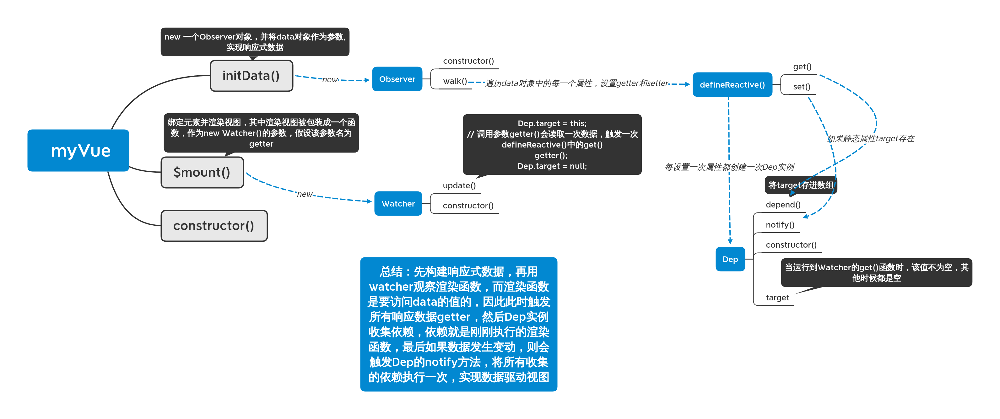

## 模拟vue实现响应式数据

流程图如下：




实现代码：

```html
<div id="app"></div>
<button onclick="plus()">plus</button>

<script>

  //　设置代理，这样访问vm.attr相当于访问vm.option.data.attr
  function initProxy(vm, sourceKey, key) {
    Object.defineProperty(vm, key, {
      get() {
        return vm[sourceKey][key]
      },
      set(nValue) {
        console.log('proxy set')
        vm[sourceKey][key] = nValue
      }
    })
    //　以下写法是错的，_value是vm[sourceKey][key]的一个拷贝，不等同于vm[sourceKey][key]
    //　因此 _value = nValue 只是改变了_value的值，并没有改变vm[sourceKey][key]的值
    // let _value = vm[sourceKey][key]
    // Object.defineProperty(vm, key, {
    //   get() {
    //     return _value
    //   },
    //   set(nValue) {
    //     console.log('proxy set')
    //     _value = nValue
    //   }
    // })
  }

  class myVue {
    constructor(opt) {
      this._option = opt
      this.initData()
      this.$mount()
    }

    initData() {
      this._data = this._option.data
      // return后如果连着new一定要加分号
      if (!this._data || typeof this._data != 'object') return;
      Object.keys(this._data).forEach(key => {
        initProxy(this, '_data', key)
      })
      new Oberser(this._data)
    }

    $mount() {
      this._el = this._option.el
      const fn = () => {
        document.querySelector(this._el).innerHTML = `渲染视图 data:${this.test}`
        console.log(`渲染视图 data:${this.test}`)
      }
      new Watcher(fn)
    }
  }

  class Oberser {
    constructor(data) {
      this.work(data)
    }
    work(data) {
      Object.keys(data).forEach(key => {
        defineReactive(data, key)
      })
    }
  }

  function defineReactive(obj, key) {
    const property = Object.getOwnPropertyDescriptor(obj);
    if (property && property.configurable === false) return;
    const dep = new Dep()
    // 这样写obj[key]始终保持初始值，而展示在界面上的始终是_val
    let _val = obj[key]
    Object.defineProperty(obj, key, {
      get() {
        if (Dep.target) {
          dep.depend()
        }
        return _val
      },
      set(nval) {
        console.log('set')
        // 必须先赋值再调用notify()
        _val = nval
        dep.notify()
      }
    })
  }

  class Dep {
    constructor() {
      // 这个target要定义成静态属性，不能是实例属性，因此要在外面定义
      // this.target = null
      this.targetSet = new Set()
    }

    depend() {
      if (Dep.target) {
        this.targetSet.add(Dep.target)
      }
    }

    notify() {
      this.targetSet.forEach(fn => {
        fn()
      })
    }
  }

  Dep.target = null

  class Watcher {
    constructor(fn) {
      this.update(fn)
    }
    update(fn) {
      Dep.target = fn
      fn()
      Dep.target = null
    }
  }

  let vm = new myVue({
    el: '#app',
    data: {
      test: 12
    }
  })

  function plus() {
    console.log('click')
    vm.test++;
  }
</script>
```


## vue3.0问题汇总

- 使用二进制定义枚举类型的好处？

方便联合类型的赋值和判断，比如

```ts
const enum Flags {
    TEACHER = 1, // 老师
    STUDENT = 1 << 1, // 学生
    BOY = 1 << 2, // 男生
    GIRL = 1 << 3, // 女生
}
// Tom 是一名男老师
const Tom = Flags.TEACHER | Flags.BOY

if(Tom & Flags.TEACHER){
    console.log("Tom 是一名老师")
}

if(Tom & Flags.BOY){
    console.log("Tom 是男的")
}

```

- ref与reactive的关系？

使用ref创建的对象含有__v_isRef属性，当这个属性为true时，vue会挂上一层代理，使得模板可以直接使用\{\{ref}\}，而不用展开写；另外，使用ref若传入的参数为对象时，才会调用reactive方法返回代理后的实例。

- ref/reactive如何实现递归代理嵌套的key?

关键在于这里

```ts
const test = {a:1}
const proxy = new Proxy(test,{
    get(target, key, receiver){
        const res = Reflect.get(target, key, receiver)
        if(typeof res === 'object'){
            // 这里递归调用了
            return reactive(res)
        }
        return res
	}
})

```

- toRef的本质？

```ts
// 关键代码
// 举个例子：如调用key = toRef(object,"key")
// 当我们访问key.value就相当于直接调用object.key
// 所以如果这个object是用reactive创建的，那么这个key是具有响应式的，否则并不具备响应式
class ObjectRefImpl<T extends object, K extends keyof T> {
  public readonly __v_isRef = true

  constructor(private readonly _object: T, private readonly _key: K) {}

  get value() {
    return this._object[this._key]
  }

  set value(newVal) {
    this._object[this._key] = newVal
  }
}
```