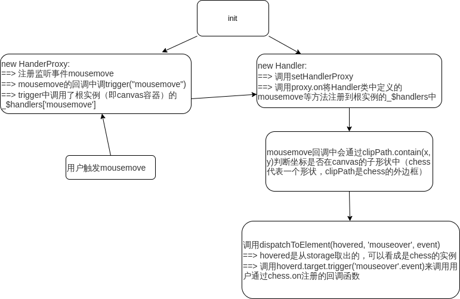

## 从一个例子梳理zrender的事件系统

样例代码如下：

```js
  const container = document.getElementById('zr')

  const zr = zrender.init(container!)
  const Chessboard = new zrender.Image({
    style: {
      image: '/chess/src/assets/chessBoard.jpg',
      height: chessboardHeight || 0,
    },
  })

  const Chess = new zrender.Image({
    style: {
      image: '/chess/src/assets/red/b.png',
      height: unitWidth || 0,
    },
  })

  const Chess2 = new zrender.Image({
    style: {
      image: '/chess/src/assets/red/p.png',
      height: unitWidth || 0,
      x: unitWidth * 5,
      y: unitWidth * 5,
    },
  })

  Chess.on('mouseover', () => {
    Chess.setStyle({
      height: unitWidth + 10 || 0,
    })
  })

  Chess2.on('mouseover', () => {
    Chess2.setStyle({
      height: unitWidth + 10 || 0,
    })
  })

  zr.add(Chessboard)
  zr.add(Chess)
  zr.add(Chess2)
```




**注： zrender本身不注册mouseover事件，是在mousemove回调中通过isHover判断是否调用trigger("mouseover")来达成目的的**